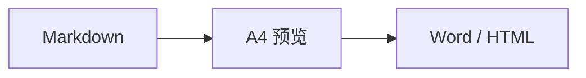

<div align="center">
	
	<h1>SangDocCraft</h1>
	<p>面向正式交付文档的 Markdown 编辑、A4 排版与导出工具</p>
	<p>
		<a href="https://github.com/sangyuxiaowu/SangDocCraft/releases"></a>
		<a href="LICENSE.txt"></a>
		
		
		<a href="#赞赏支持"></a>
	</p>
</div>

SangDocCraft 将 Markdown 编辑、AI 辅助写作、分页预览和样式配置集中在一个工作区中，适合编写技术方案、架构设计、项目报告等需要规范版式的文档。项目既可作为 Web 应用运行，也可通过 Tauri 构建为桌面应用。

## 下载使用

SangDocCraft 可通过以下方式下载使用：

- **Web 端**：直接访问 <https://sangyuxiaowu.github.io/SangDocCraft/> 使用，无需安装。
- **桌面端**：前往 [GitHub Releases](https://github.com/sangyuxiaowu/SangDocCraft/releases) 下载对应平台的安装包进行安装。

也可以直接前往网盘下载最新的安装包：[百度网盘链接](https://pan.baidu.com/s/1w0eFRlDX9WXqckSQZcAclA?pwd=mnjf)，提取码: `mnjf`。

## 功能特性

- **实时 A4 预览**：提供双栏预览、专注编辑和 A4 全屏三种视图，支持拖动调整编辑区宽度、文档大纲和页码导航；双栏模式下双击 Markdown 内容可定位到对应预览位置。
- **自动分页排版**：根据页面尺寸处理段落、列表、表格、代码块和图片，支持手动分页符。
- **完整文档结构**：可配置封面、目录、页眉、页脚、页码和标题层级样式。
- **可视化主题配置**：调整字体、字号、配色、正文段前/段后间距、列表、表格、代码块及 Mermaid 图表主题。
- **文档水印**：支持文本或图片水印，可设为居中单个或平铺，并调整透明度、旋转和封面显示；A4 预览、HTML 与打印 PDF 均会保留水印。
- **主题管理**：内置多套交付主题，支持创建、导入、导出和持久化自定义主题。
- **高效 Markdown 编辑**：支持常用 Markdown 语法、任务列表、表格题注、图片尺寸、上标/下标、Mermaid 图表、LaTeX 数学公式和手动分页，并可使用 Tab/Shift+Tab 缩进选区、直接粘贴剪贴板图片。
- **编辑器字体设置**：可调整编辑区字体、字号和行距，设置会本地记忆，也可一键恢复默认。
- **选中文本统计**：状态栏显示当前选中字符数，悬停可查看更详细统计信息。
- **AI 辅助编辑**：支持配置多个服务端点和模型、自定义系统提示词与快捷提示词；AI 可读取文档结构、调用排版工具修改正文或样式，并在差异审查后逐项接受或拒绝变更。
- **智能预览定位**：编辑器与 A4 预览支持双向双击定位，可选开启滚动同步；超长页面提供页码输入导航并标记超出 A4 高度的页面，异常 Mermaid 图表不会破坏整体预览布局。
- **SangDocCraft 文档**：使用 `.sdc` ZIP 文档包统一保存 Markdown、主题、图片、设置与可选编辑历史。
- **统一图片管理**：支持批量上传、网络图片收集、SHA-256 去重、WebP 压缩和引用保护。单张压缩可选择生成 WebP 副本或覆盖原图。
- **批量图片优化**：一次压缩文档内全部非 WebP 图片，可按图片显示尺寸重采样、移除未被引用的图片，并给出体积节省统计。
- **文档与永久图片库**：文档图片随文档切换清理，永久图片可供自定义主题、封面和页眉复用。
- **多格式导出**：导出 Word (`.docx`)、单文件 HTML (`.html`) 或完整 SangDocCraft 文档 (`.sdc`)，也可通过隔离的 A4 页面打印或另存为 PDF。
- **自动保存与历史**：编辑器实时显示保存状态；Web 端保存到 IndexedDB 恢复草稿，Tauri 端可自动落盘，并支持文档级编辑历史，可单独删除或清空不再需要的快照。
- **桌面端支持**：基于 Tauri 2 构建 Windows、macOS 和 Linux 应用，支持 `.sdc` 文件关联。
- **可离线安装**：Web 端构建包含 PWA 清单与 Service Worker，可安装为独立窗口应用并离线使用。

## 技术栈

| 分类 | 技术 |
| --- | --- |
| 前端 | React 19、TypeScript、Vite 6、Tailwind CSS 4 |
| Markdown | Marked、Mermaid、MathJax |
| 文档导出 | docx |
| 文档容器 | fflate、IndexedDB |
| 离线与安装 | vite-plugin-pwa |
| 桌面端 | Tauri 2、Rust |
| 测试 | Vitest、jsdom |

## 快速开始

### 环境要求

- Node.js 18 或更高版本
- npm 或兼容的包管理器
- 构建桌面应用时，需额外安装 [Rust](https://www.rust-lang.org/tools/install) 和对应平台的 [Tauri 系统依赖](https://v2.tauri.app/start/prerequisites/)

### Web 开发

```bash
npm install
npm run dev
```

开发服务器默认运行在 <http://localhost:3000>。

构建并预览生产版本：

```bash
npm run build
npm run preview
```

### 桌面端开发

```bash
npm install
npm run dev:tauri
```

构建桌面安装包：

```bash
npm run build:tauri
```

构建产物位于 `src-tauri/target/release/bundle/`。`prebuild:tauri` 会在构建前同步版本号，并使用 `docs/assets/logo.png` 重新生成桌面图标。

## 使用说明

1. 使用顶部的新建、打开和保存按钮管理文档，在欢迎页文档模板中心选择空白文档或内置模板快速起步；内置模板涵盖系统指南、技术方案、UI 设计规范、商业计划书、学术论文和会议纪要，并各自关联推荐主题。
2. 在左侧编辑 Markdown，通过工具栏插入标题、表格、分页符、上标/下标或图片；可粘贴剪贴板图片，并用 Tab/Shift+Tab 调整缩进。工具栏右侧的齿轮按钮可调整编辑器字体、字号和行距。
3. 选中文本后，编辑器底部状态栏会显示选中字符数，悬停该提示可查看更详细的统计信息。
4. 选择双栏、专注编辑或 A4 全屏视图检查最终分页效果；在双栏模式下双击编辑内容可定位预览，也可使用文档大纲和页码导航（可直接输入目标页码，或跳转首页 / 尾页）。
5. 从右侧面板配置封面、页眉页脚、目录、配色和正文样式；在「样式」的「其他」页签可启用文本或图片水印，并设置居中或平铺、透明度、旋转及封面显示。
6. 在“图片”中批量上传、压缩或收集正文、封面及页眉使用的网络图片；单张图片可生成 WebP 副本或覆盖原图，也可用“整体压缩”批量优化整个文档。
7. 使用主题菜单切换预设主题，或在“主题管理”中维护自定义主题。
8. 需要联动检查时，在编辑器底部状态栏开启滚动同步；如果页面内容过高，按提示检查对应页并使用页码输入框快速跳转。
9. 打开“AI 助手”配置端点、模型和提示词；AI 生成正文修改后，在差异审查面板中逐项确认，再应用到编辑器。
10. 从“导出文档”生成 Word、单文件 HTML 或完整 `.sdc` 文档包，或使用“打印 / 导出 PDF”调用系统打印。

### 文档保存

- **Web**：自动保存和 `Ctrl+S` 只写入浏览器 IndexedDB，不会自动下载文件。需要迁移或备份时，从“导出文档”明确下载 `.sdc`。
- **Tauri**：首次 `Ctrl+S` 选择 `.sdc` 路径，之后手动保存和防抖自动保存均写入该文件。
- **恢复草稿**：应用启动时检测到未保存草稿会询问是否恢复。
- **编辑历史**：可为单个文档启用。手动保存和达到设置的空闲时间时生成去重快照，最多保留 50 条；每条快照记录生成时的文档版本号，可预览、复制 Markdown、恢复、单独删除或清空全部。
- **保存状态**：编辑器底部会显示正在保存、有未保存修改或最近自动保存时间。

`.sdc` 本质是 ZIP 容器，包含正文、主题、图片元数据、去重后的图片和文档设置。格式细节见 [SangDocCraft 文档格式](docs/sdc-format.md)。

### 图片管理

- `@images/<id>` 表示当前文档图片。
- `@library/<id>` 表示永久图片库资源。
- “收集文档网络图片”会扫描 Markdown 图片、封面 Logo 和页眉 Logo，下载后改写为内部引用；普通超链接不会改写。
- 正文、封面或页眉仍在引用的图片不能删除。
- 保存自定义主题时，主题引用的文档图片会自动提升到永久图片库。
- 删除图片不可撤销，且引用该图片的历史快照会同步失效。

单张压缩时可选择“生成副本”保留原图，或“覆盖原图”用压缩后的 WebP 数据替换原文件。覆盖时图片 ID 保持不变，正文、封面与页眉中的引用无需修改即可生效，但历史快照中使用该图片的页面同样会显示压缩后的效果。

“整体压缩”针对整个文档批量处理：

- 调整 WebP 质量滑块控制压缩强度，质量越低体积越小。
- 开启“处理分辨率（重采样）”后，仅对正文、封面或页眉中设置了宽度或高度的图片按 `显示尺寸 × 倍率` 重新采样，倍率可选 1x、1.5x、2x；不会放大原图，未设置尺寸的图片只做格式压缩。
- 可选择移除本文档中未被正文、封面或页眉引用的图片，素材库图片不受影响。
- 压缩后体积未减小的图片会被跳过，完成后给出压缩、重采样、移除数量与共节省体积。

从编辑器工具栏选择图片时，可选填写宽度 `w` 和高度 `h`。留空时保持图片比例：

```markdown

{w=640}
{w=640 h=360}
```

### 文档水印

在右侧「样式」面板切换到「其他」页签，启用「文档水印」后可选择：

- **文本水印**：填写水印文字，并调整字号、颜色、透明度和旋转角度。
- **图片水印**：从当前文档图片中选择素材，并设置显示宽度、透明度和旋转角度。
- **布局**：可选择页面居中显示一个大水印，或按设置的间距重复平铺。
- **封面**：默认隐藏封面水印，可按需要取消该限制。

水印在 A4 预览、单文件 HTML 和打印生成的 PDF 中保留；当前 Word 导出不包含水印。

### 扩展语法

编辑器支持以下快捷交互：

- 选中一行或多行后按 `Tab` 增加缩进，按 `Shift+Tab` 减少缩进。
- 直接粘贴剪贴板图片，图片会存入当前文档并自动插入内部引用。
- 点击工具栏右侧的齿轮按钮可调整编辑器字体、字号和行距。
- 选中文本后状态栏会显示选中字符数，悬停或聚焦该提示可查看更详细统计。
- 在双栏模式下双击 Markdown 内容，将预览滚动到对应位置。
- 选中文本后点击工具栏的上标或下标按钮，可将其包裹为 `<sup>` 或 `<sub>`。

插入强制分页符：

```html
<!-- pagebreak -->
```

为表格添加标题：

```html
<!-- caption: 表格标题 -->
```

上标和下标使用 `<sup>` 与 `<sub>`，工具栏中也有对应按钮；导出 HTML 与 Word 时均会保留上下标语义：

```html
水的分子式是 H<sub>2</sub>O，质能方程写作 E = mc<sup>2</sup>。
```

Mermaid 图表使用标准围栏代码块：

````markdown

````

右侧「样式」面板的「Mermaid 图表配色」设置当前文档内图表的默认主题；初始为 `neutral`。选择 `custom` 后可以调整节点、连线和背景颜色。也可以在单张图表的围栏语言后添加属性，覆盖文档默认主题并控制尺寸、对齐方式：

````markdown

````

支持 `neutral`、`default`、`dark`、`forest`、`base` 和 `custom`。各属性及导出差异见 [Mermaid 图表指南](docs/mermaid-guide.md)。

数学公式使用 LaTeX 语法，行内公式用单个 `$`，独立公式块用独占一行的 `$$`：

```markdown
打分融合公式 $score(q, d)$ 定义如下：

$$
score(q, d) = \sum_{i=1}^{n} w_i \cdot sim(q, d_i)
$$
```

也支持 `\(...\)`、`\[...\]` 与 `\begin{equation}...\end{equation}` 等写法。公式由 MathJax 渲染为矢量 SVG，参与分页测量；导出 HTML/PDF 时保持矢量清晰度，导出 Word 时自动栅格化为图片。为避免误判，正文中的货币金额（如 `$5`）不会被识别为公式。

### AI 辅助编辑

- 顶部“AI 助手”可打开可拖动的对话浮窗；编辑器工具栏也提供快速入口。
- 在 AI 设置中维护服务端点、模型、推理强度、系统提示词和快捷提示词，并可测试当前模型连接。
- AI 对话按文档保存历史会话；保存或打开 `.sdc` 文档时会一并保存或恢复会话记录。
- 涉及正文修改时，系统会先创建历史快照并打开差异审查，支持逐项接受、拒绝、全部处理或取消；工具调用失败或超时后可重试。
- AI 使用与系统一致的 `pagebreak`、表格题注、图片引用、Mermaid 与 LaTeX 公式语法，修改前会读取当前文档状态与章节结构。

### 预览定位与分页检查

- 双栏模式下双击编辑器内容可定位预览，双击预览正文也可定位回编辑器对应位置。
- 编辑器底部状态栏的“滚动同步”开关为双向同步：滚动预览会同步编辑器位置，滚动编辑器也会同步预览；开启时双击定位会停用。
- 页码导航支持直达首页 / 尾页并输入目标页码；当某页内容超过 A4 可用高度时，预览会显示提醒并列出对应页码。

> [!NOTE]
> Web 草稿和永久图片库存储在当前浏览器的 IndexedDB 中。清理站点数据前，请先下载重要 `.sdc` 文档。

## 常用脚本

| 命令 | 说明 |
| --- | --- |
| `npm run dev` | 启动 Vite 开发服务器 |
| `npm run build` | 构建 Web 生产版本 |
| `npm run preview` | 本地预览 Web 构建产物 |
| `npm run lint` | 执行 TypeScript 类型检查 |
| `npm test` | 运行 Vitest 测试 |
| `npm run clean` | 清理 Web 构建产物 |
| `npm run dev:tauri` | 启动 Tauri 桌面开发模式 |
| `npm run build:tauri` | 构建桌面安装包 |
| `npm run prebuild:tauri` | 同步版本并生成桌面图标 |
| `npm run tauri` | 直接调用 Tauri CLI，例如 `npm run tauri info` |
| `npm run release` | 在 `main` 分支提交版本、创建标签并推送远程仓库 |

> [!WARNING]
> `release` 会执行 Git 提交及推送操作，仅应在确认版本号和工作区状态后使用。

## 项目结构

```text
SangDocCraft/
├─ src/
│  ├─ components/       # 编辑器、预览和配置面板
│  ├─ data/             # 预设主题、模板注册表与模板 Markdown 正文
│  │  └─ templates/     # 每个文档模板一个 .md 正文文件
│  ├─ lib/              # AI 端点配置与密钥存储
│  ├─ themes/           # 主题注册、封面插件与主题存储
│  ├─ types/            # 共享类型定义
│  └─ utils/            # 文档包、图片仓库、Markdown 排版、分页及导出逻辑
├─ src-tauri/           # Tauri 桌面端配置与 Rust 入口
├─ docs/                # 文档格式说明与图像资源
├─ scripts/             # 版本同步和发布脚本
└─ public/              # Web 静态资源
```

## 质量检查

提交代码前建议运行：

```bash
npm run lint
npm test
npm run build
```

## 赞赏支持

SangDocCraft 完全免费、无广告，不设付费功能，全部代码基于 Apache 2.0 开源。如果它帮你省下了排版校对和导出 Word 的时间，欢迎微信扫码赞赏支持作者（桑榆肖物）。

<div align="center">
	
	<br />
	<sub>微信扫一扫，赞赏支持作者</sub>
</div>

除微信赞赏外，也欢迎通过这些方式支持项目：

- 在 [GitHub](https://github.com/sangyuxiaowu/SangDocCraft) 点亮 Star，让更多需要规范交付文档的人看到它。
- 通过 [Issues](https://github.com/sangyuxiaowu/SangDocCraft/issues) 反馈问题，或直接提交 Pull Request 一起完善排版与导出体验。
- 应用内的“关于”弹窗和欢迎页同样提供赞赏入口。

> [!NOTE]
> 赞赏完全自愿。无论是否赞赏，功能、更新与使用体验对所有用户完全一致。

## 许可证

本项目基于 [Apache License 2.0](LICENSE.txt) 开源。
