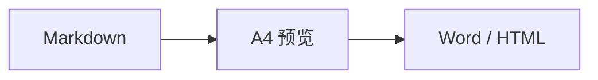

<div align="center">
	
	<h1>SangDocCraft</h1>
	<p>面向正式交付文档的 Markdown 编辑、A4 排版与导出工具</p>
</div>

SangDocCraft 将 Markdown 编辑、分页预览和样式配置集中在一个工作区中，适合编写技术方案、架构设计、项目报告等需要规范版式的文档。项目既可作为 Web 应用运行，也可通过 Tauri 构建为桌面应用。

## 功能特性

- **实时 A4 预览**：提供双栏预览、专注编辑和 A4 全屏三种视图，并支持拖动调整编辑区宽度。
- **自动分页排版**：根据页面尺寸处理段落、列表、表格、代码块和图片，支持手动分页符。
- **完整文档结构**：可配置封面、目录、页眉、页脚、页码和标题层级样式。
- **可视化主题配置**：调整字体、字号、配色、间距、列表、表格和代码块样式。
- **主题管理**：内置多套交付主题，支持创建、导入、导出和持久化自定义主题。
- **丰富 Markdown 内容**：支持常用 Markdown 语法、任务列表、表格题注、图片尺寸、Mermaid 图表和手动分页。
- **SangDocCraft 文档**：使用 `.sdc` ZIP 文档包统一保存 Markdown、主题、图片、设置与可选编辑历史。
- **统一图片管理**：支持批量上传、网络图片收集、SHA-256 去重、WebP 压缩和引用保护。
- **文档与永久图片库**：文档图片随文档切换清理，永久图片可供自定义主题、封面和页眉复用。
- **多格式导出**：导出 Word (`.docx`)、单文件 HTML (`.html`) 或完整 SangDocCraft 文档 (`.sdc`)。
- **自动保存与历史**：Web 端保存到 IndexedDB 恢复草稿；Tauri 端可自动落盘，并支持文档级编辑历史。
- **桌面端支持**：基于 Tauri 2 构建 Windows、macOS 和 Linux 应用，支持 `.sdc` 文件关联。

## 技术栈

| 分类 | 技术 |
| --- | --- |
| 前端 | React 19、TypeScript、Vite 6、Tailwind CSS 4 |
| Markdown | Marked、Mermaid |
| 文档导出 | docx |
| 文档容器 | fflate、IndexedDB |
| 桌面端 | Tauri 2、Rust |
| 测试 | Vitest、jsdom |

## 快速开始

### 环境要求

- Node.js 18 或更高版本
- npm 或兼容的包管理器
- 构建桌面应用时，需额外安装 [Rust](https://www.rust-lang.org/tools/install) 和对应平台的 [Tauri 系统依赖](https://v2.tauri.app/start/prerequisites/)

### Web 开发

```bash
npm install
npm run dev
```

开发服务器默认运行在 <http://localhost:3000>。

构建并预览生产版本：

```bash
npm run build
npm run preview
```

### 桌面端开发

```bash
npm install
npm run dev:tauri
```

构建桌面安装包：

```bash
npm run build:tauri
```

构建产物位于 `src-tauri/target/release/bundle/`。`prebuild:tauri` 会在构建前同步版本号，并使用 `docs/assets/logo.png` 重新生成桌面图标。

## 使用说明

1. 使用顶部的新建、打开和保存按钮管理文档，或从“载入范本”选择示例内容。
2. 在左侧编辑 Markdown，通过工具栏插入标题、表格、分页符或图片。
3. 选择双栏、专注编辑或 A4 全屏视图检查最终分页效果。
4. 从右侧面板配置封面、页眉页脚、目录、配色和正文样式。
5. 在“图片”中批量上传、压缩或收集正文、封面及页眉使用的网络图片。
6. 使用主题菜单切换预设主题，或在“主题管理”中维护自定义主题。
7. 从“导出文档”生成 Word、单文件 HTML 或完整 `.sdc` 文档包。

### 文档保存

- **Web**：自动保存和 `Ctrl+S` 只写入浏览器 IndexedDB，不会自动下载文件。需要迁移或备份时，从“导出文档”明确下载 `.sdc`。
- **Tauri**：首次 `Ctrl+S` 选择 `.sdc` 路径，之后手动保存和防抖自动保存均写入该文件。
- **恢复草稿**：应用启动时检测到未保存草稿会询问是否恢复。
- **编辑历史**：可为单个文档启用。手动保存和达到设置的空闲时间时生成去重快照，最多保留 50 条。

`.sdc` 本质是 ZIP 容器，包含正文、主题、图片元数据、去重后的图片和文档设置。格式细节见 [SangDocCraft 文档格式](docs/sdc-format.md)。

### 图片管理

- `@images/<id>` 表示当前文档图片。
- `@library/<id>` 表示永久图片库资源。
- “收集文档网络图片”会扫描 Markdown 图片、封面 Logo 和页眉 Logo，下载后改写为内部引用；普通超链接不会改写。
- 正文、封面或页眉仍在引用的图片不能删除。
- 保存自定义主题时，主题引用的文档图片会自动提升到永久图片库。

从编辑器工具栏选择图片时，可选填写宽度 `w` 和高度 `h`。留空时保持图片比例：

```markdown

{w=640}
{w=640 h=360}
```

### 扩展语法

插入强制分页符：

```html
<!-- pagebreak -->
```

为表格添加标题：

```html
<!-- caption: 表格标题 -->
```

Mermaid 图表使用标准围栏代码块：

````markdown

````

> [!NOTE]
> Web 草稿和永久图片库存储在当前浏览器的 IndexedDB 中。清理站点数据前，请先下载重要 `.sdc` 文档。

## 常用脚本

| 命令 | 说明 |
| --- | --- |
| `npm run dev` | 启动 Vite 开发服务器 |
| `npm run build` | 构建 Web 生产版本 |
| `npm run preview` | 本地预览 Web 构建产物 |
| `npm run lint` | 执行 TypeScript 类型检查 |
| `npm test` | 运行 Vitest 测试 |
| `npm run clean` | 清理 Web 构建产物 |
| `npm run dev:tauri` | 启动 Tauri 桌面开发模式 |
| `npm run build:tauri` | 构建桌面安装包 |
| `npm run prebuild:tauri` | 同步版本并生成桌面图标 |
| `npm run release` | 在 `main` 分支提交版本、创建标签并推送远程仓库 |

> [!WARNING]
> `release` 会执行 Git 提交及推送操作，仅应在确认版本号和工作区状态后使用。

## 项目结构

```text
SangDocCraft/
├─ src/
│  ├─ components/       # 编辑器、预览和配置面板
│  ├─ data/             # 内置 Markdown 范本与预设数据
│  ├─ themes/           # 主题注册、封面插件与主题存储
│  └─ utils/            # 文档包、图片仓库、Markdown 排版、分页及导出逻辑
├─ src-tauri/           # Tauri 桌面端配置与 Rust 入口
├─ docs/assets/         # 文档与应用图像资源
├─ scripts/             # 版本同步和发布脚本
└─ public/              # Web 静态资源
```

## 质量检查

提交代码前建议运行：

```bash
npm run lint
npm test
npm run build
```

## 许可证

本项目基于 [Apache License 2.0](LICENSE.txt) 开源。
