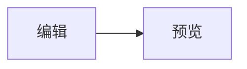
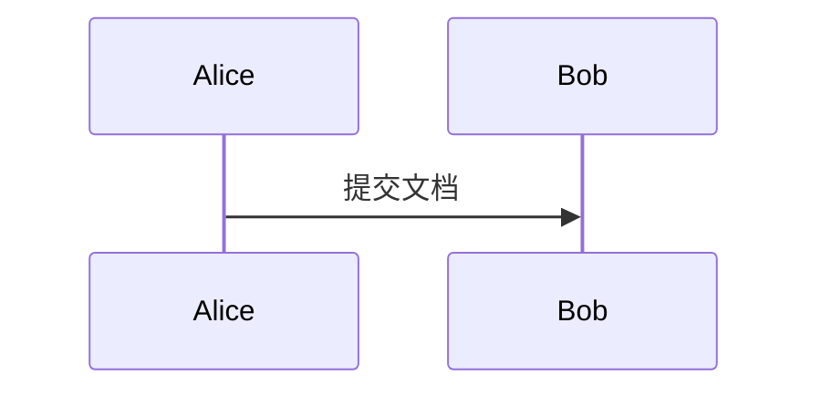
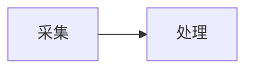

# Mermaid 图表指南

## 设置文档默认主题

在右侧「样式」面板的「Mermaid 图表配色」中选择图表主题。新文档默认使用 `neutral`；未指定单图主题的 Mermaid 围栏继承当前文档的设置，不会自动跟随代码块的深浅模式。

选择 `custom` 后，可以在面板中调整主节点背景与文字、节点边框、连线、次级节点背景和图表底板背景。配色保存在文档主题中；即使文档默认主题不是 `custom`，单张图表仍可通过 `{theme=custom}` 使用这些配色。

## 在 A4 预览中调整单图

点击预览中的 Mermaid 图表，会显示悬浮控制层。拖动右侧手柄调整宽度、底部手柄调整高度；工具条可输入像素尺寸、切换左中右对齐，或选择单图主题。松手或确认后，仅修改当前图表的 Markdown 围栏首行，并重新分页。未调整的属性会保留原值；把主题改为「文档默认」会移除单图 `theme`。图内已有 `init` 主题指令时，主题选择不可用。

高度控制图表占位，不会拉伸 SVG 图形本身；设置过小可能裁切内容。滚动预览或开合设置面板会关闭控制层。原有百分比宽度可继续手动编辑；在工具条输入宽度或拖动后，该图表的宽度改写为像素值。

## 在围栏中覆盖单图

普通 Mermaid 围栏使用文档默认主题：

````markdown

````

只修改一张图表时，在 `mermaid` 后添加花括号属性，各项以空格分隔：

````markdown



````

| 属性 | 可用值与行为 |
| --- | --- |
| `theme` | `neutral`、`default`、`dark`、`forest`、`base`、`custom`；省略时继承文档默认主题。`custom` 使用面板中保存的配色。 |
| `w` / `width` | 正整数像素值（如 `500`、`500px`）或百分比（如 `80%`）；省略时按图表内容与页面宽度自适应。 |
| `h` / `height` | 正整数像素值（如 `320`、`320px`）或 `auto`；数值高度为图表容器预留固定空间并参与 A4 分页，`auto` 按内容自然排版。高度太小时图表可能被裁切。 |
| `align` | `left`、`center`、`right`；省略时居中。 |

属性只影响当前图表，不修改文档默认主题。图内已有 Mermaid `init` 主题指令时，以图内声明为准，不再额外注入围栏或面板主题。

## 图题注

在 Mermaid 围栏前添加 `<!-- caption: 题注文本 -->`，可为图表添加题注：

````markdown
<!-- caption: 数据处理结构 -->


````

题注与普通图片共用「图」编号，以及图片题注的显示、自动编号、前缀和对齐设置。题注会随图表一起参与 A4 分页，并保留在 HTML、打印 PDF 和 Word 导出中。

## 预览与导出

- A4 预览会在图表渲染完成后测量未指定高度的图表并重新分页；指定数值 `h` 时先按该高度排版。高度设置只能控制图表占位，不能保证任何图表都不会跨页或被裁切。
- 单文件 HTML 保留图表 SVG、单图主题与布局；从 HTML 打印 PDF 时由浏览器执行打印排版。
- Word 导出把图表转成双倍像素密度的 PNG。百分比宽度以 Word 图表最大宽度 560 为基准计算；导出图像的宽高分别不超过 560 和 640，必要时在指定范围内等比居中并留出底色边缘。对齐方式在 Word 段落中生效，因此与预览的排版可能有细微差异。

相关存储结构见 [SangDocCraft 文档格式](sdc-format.md)。