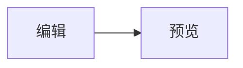
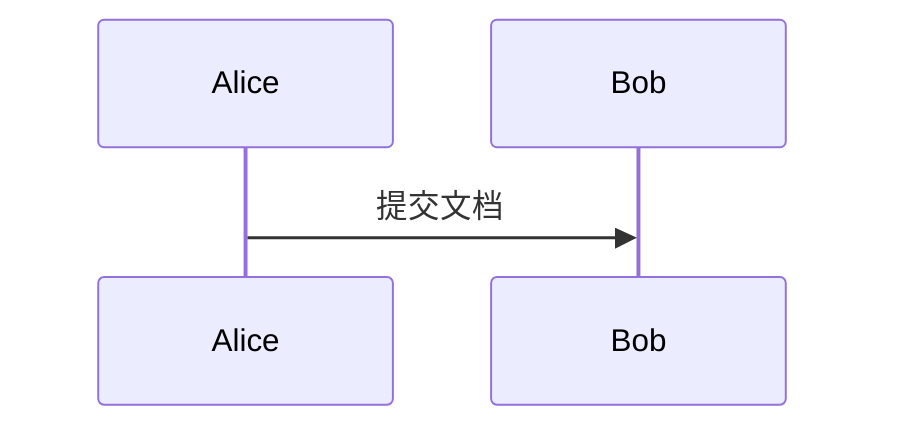

# Mermaid 图表指南

## 设置文档默认主题

在右侧「样式」面板的「Mermaid 图表配色」中选择图表主题。新文档默认使用 `neutral`；未指定单图主题的 Mermaid 围栏继承当前文档的设置，不会自动跟随代码块的深浅模式。

选择 `custom` 后，可以在面板中调整主节点背景与文字、节点边框、连线、次级节点背景和图表底板背景。配色保存在文档主题中；即使文档默认主题不是 `custom`，单张图表仍可通过 `{theme=custom}` 使用这些配色。

## 在围栏中覆盖单图

普通 Mermaid 围栏使用文档默认主题：

````markdown

````

只修改一张图表时，在 `mermaid` 后添加花括号属性，各项以空格分隔：

````markdown



````

| 属性 | 可用值与行为 |
| --- | --- |
| `theme` | `neutral`、`default`、`dark`、`forest`、`base`、`custom`；省略时继承文档默认主题。`custom` 使用面板中保存的配色。 |
| `w` / `width` | 正整数像素值（如 `500`、`500px`）或百分比（如 `80%`）；省略时按图表内容与页面宽度自适应。 |
| `h` / `height` | 正整数像素值（如 `320`、`320px`）或 `auto`；数值高度为图表容器预留固定空间并参与 A4 分页，`auto` 按内容自然排版。高度太小时图表可能被裁切。 |
| `align` | `left`、`center`、`right`；省略时居中。 |

属性只影响当前图表，不修改文档默认主题。图内已有 Mermaid `init` 主题指令时，以图内声明为准，不再额外注入围栏或面板主题。

## 预览与导出

- A4 预览会在图表渲染完成后测量未指定高度的图表并重新分页；指定数值 `h` 时先按该高度排版。高度设置只能控制图表占位，不能保证任何图表都不会跨页或被裁切。
- 单文件 HTML 保留图表 SVG、单图主题与布局；从 HTML 打印 PDF 时由浏览器执行打印排版。
- Word 导出把图表转成双倍像素密度的 PNG。百分比宽度以 Word 图表最大宽度 560 为基准计算；导出图像的宽高分别不超过 560 和 640，必要时在指定范围内等比居中并留出底色边缘。对齐方式在 Word 段落中生效，因此与预览的排版可能有细微差异。

相关存储结构见 [SangDocCraft 文档格式](sdc-format.md)。