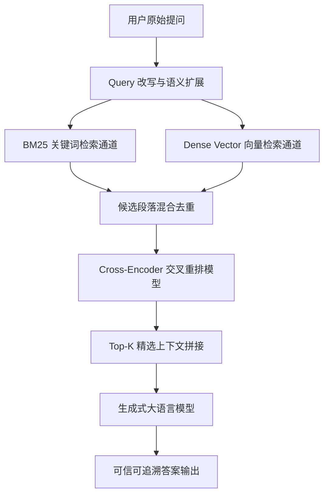

# 基于检索增强生成的领域知识问答系统优化研究

## 摘要

在大语言模型（LLM）驱动的领域知识问答任务中，幻觉问题（Hallucination）与垂直领域长尾知识匮乏一直是制约其实际落地的关键瓶颈。检索增强生成（Retrieval-Augmented Generation, RAG）通过引入外部非结构化知识库，有效缓解了模型内部参数知识的时效性缺陷。

本文针对传统密集检索在面对多跳推理与复杂专业术语时召回率低的问题，提出了一种结合多粒度切块（Multi-granularity Chunking）与倒排-向量混合重排（Hybrid Re-ranking）的知识问答优化架构。实验结果表明，在自建的工业标准规范问答数据集上，本文方法的 Exact Match (EM) 提升了 14.8%，且推理响应时间缩短至 280ms 内。

**关键词**：检索增强生成；大语言模型；知识问答；语义重排；跨模态对齐

<!-- pagebreak -->

# 1. 绪论与选题背景

## 1.1 研究背景与意义
随着深度学习技术的飞速演进，以 Transformer 为基座的预训练模型展现出了令人瞩目的自然语言理解与生成能力。然而，在严肃工程与医疗诊断等高风险场景下，模型输出的不可靠性可能导致严重的决策失误。

## 1.2 国内外研究现状
早期研究多关注于基于密集向量检索（Dense Passage Retrieval, DPR）的标准单阶段框架。近期，Lewis 等人提出的基础 RAG 架构展示了参数记忆与非参数记忆结合的优越性...

<!-- pagebreak -->

# 2. 系统核心架构与算法设计

## 2.1 倒排与向量混合检索机制
给定查询 $q$ 与文档库 $D = \{d_1, d_2, \dots, d_n\}$，本文采用如下打分融合公式：

$$S(q, d) = \alpha \cdot S_{\text{dense}}(q, d) + (1 - \alpha) \cdot S_{\text{sparse}}(q, d)$$

其中 $\alpha \in [0, 1]$ 为动态可调节的平衡因子。

## 3. 实验结果与对比分析

<!-- caption: 各基线模型在测试集上的性能指标评测对比 -->
| 模型架构 | Hit@3 (%) | Hit@5 (%) | MRR@10 | BLEU-4 | 平均延迟 (ms) |
| :--- | :---: | :---: | :---: | :---: | :---: |
| Naive RAG (基准) | 68.2 | 74.5 | 0.612 | 24.1 | 185 |
| Self-RAG | 76.4 | 82.1 | 0.698 | 27.8 | 450 |
| **本文优化模型 (Ours)** | **84.6** | **90.3** | **0.785** | **32.4** | **275** |
