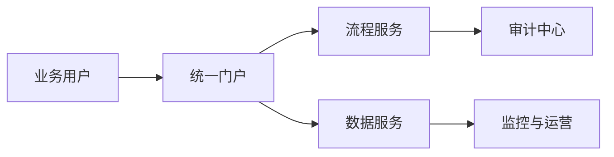

# 企业信息化项目建设方案

## 文档签审

| 角色 | 姓名 / 部门 | 审批意见 | 日期 |
| --- | --- | --- | --- |
| 编制 | 项目交付组 | 已完成方案编制 | 2026-09-22 |
| 审核 | 企业数字化中心 | 同意提交评审 | 2026-09-22 |
| 批准 | 项目负责人 | 同意按计划实施 | 2026-09-22 |

## 1. 项目概述

本项目建设统一的企业信息化协作平台，整合身份认证、业务流程、数据服务与运营监控能力，为后续系统演进提供稳定基础。

## 2. 建设范围

- 建设统一身份与权限管理能力。
- 完成核心业务流程线上化与审计留痕。
- 建立数据交换、质量检查和指标服务体系。
- 提供部署、监控、备份及应急处置方案。

## 3. 总体方案

## 4. 交付清单

| 序号 | 交付物 | 验收依据 | 责任方 |
| --- | --- | --- | --- |
| 1 | 系统部署包 | 部署验证记录 | 实施组 |
| 2 | 配置与接口说明 | 文档评审记录 | 研发组 |
| 3 | 测试报告 | 验收测试结果 | 测试组 |
| 4 | 运维手册 | 运维演练记录 | 运维组 |

## 5. 验收标准

1. 核心业务流程全部通过验收测试。
2. 权限、日志、备份与恢复机制符合安全要求。
3. 交付文档完整，版本、签审和变更记录可追溯。

## 6. 版本记录

| 版本 | 日期 | 变更内容 | 编制人 |
| --- | --- | --- | --- |
| V1.0 | 2026-09-22 | 首次正式提交 | 项目交付组 |