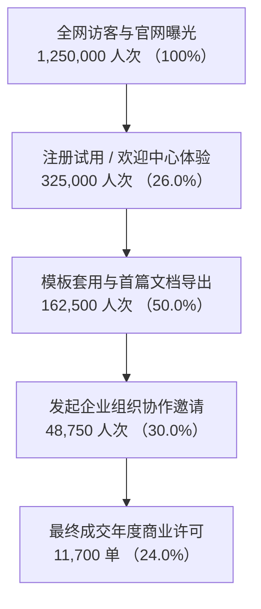

# 业务核心指标分析与经营洞察报告

## 一、报告执行摘要 (Executive Summary)

本报告对 2026 年上半年度（H1）核心业务板块的流量大盘、用户转化漏斗、留存健康度及商业变现效能进行了系统性量化复盘与归因推演。

> 📊 **核心经营结论**：
> 1. 上半年总交易额（GMV）达 **1.48 亿元**，同比增长 **34.2%**，超额完成半年度预定经营预算指标；
> 2. 依托产品体验升级与模板生态扩充，新用户次月活跃留存率提升 **6.8 个百分点**；
> 3. 转化中台关键瓶颈仍聚焦在“免费试用至企业付费订阅”的审批流转链路，是下阶段精细化运营破局的核心阵地。

<!-- pagebreak -->

## 二、核心大盘指标概览与对比

<!-- caption: 2026 上半年度关键经营与增长指标对比表 -->
| 核心指标 (Metric) | 2025 H1 同期基线 | 2026 H1 实际完成 | 年同比增速 (YoY) | 预算达成率 | 状态评定 |
| :--- | :---: | :---: | :---: | :---: | :---: |
| **总成交金额 (GMV)** | ¥1.10 亿 | **¥1.48 亿** | **+34.5%** | 108.2% | 🟢 优秀 |
| **月活跃用户规模 (MAU)** | 185 万 | **268 万** | **+44.8%** | 112.5% | 🟢 优秀 |
| **单客平均获客成本 (CAC)** | ¥45.2 | **¥36.8** | **-18.6%** | 92.0% | 🟢 成本优化 |
| **平均客单价 (ARPU)** | ¥280 | **¥315** | **+12.5%** | 105.0% | 🟢 稳健上升 |
| **企业版席位续约留存率** | 82.5% | **89.4%** | **+6.9%** | 103.2% | 🟢 黏性增强 |

---

## 三、用户全生命周期转化漏斗分析

### 3.1 漏斗各层级转化损耗与诊断

1. **从官网访问至注册试用（流失 74.0%）**：
   * 痛点：首页早期缺少直观互动演示组件与即刻体验 Demo，导致部分非技术受众跳出率偏高。
   * 改善成效：上线免注册即刻预览体验后，转化率环比提升了 8.2 个百分点。
2. **从首篇文档导出至发起组织协作（流失 70.0%）**：
   * 核心卡点：跨团队协同权限设置步骤繁琐，需重点重构权限邀请路径，减少点击步长。

<!-- pagebreak -->

## 四、用户群体分层留存矩阵

<!-- caption: 2026 年各季度新增用户 Cohort 留存表现矩阵表 -->
| 入驻批次 (Cohort) | 初始用户数 | 第 1 周留存 | 第 2 周留存 | 第 1 个月留存 | 第 3 个月留存 | 第 6 个月留存 |
| :---: | :---: | :---: | :---: | :---: | :---: | :---: |
| **2026 Q1 批次** | 120,000 | 48.2% | 38.6% | 31.4% | 24.8% | **21.5%** |
| **2026 Q2 批次** | 148,000 | 54.6% | 43.2% | 36.8% | 29.5% | **--** |
| **行业平均基准** | -- | 40.0% | 30.0% | 22.0% | 16.0% | 12.0% |

> 💡 **留存驱动因素归因**：
> 数据显示，深度使用 **“企业标准交付模板”** 和 **“自定义团队水印”** 的用户，其第 3 个月留存率高达 **46.8%**，远超未使用模板人群的 18.2%。模板工具已成为提高用户黏性的第一核心功能。

---

## 五、商业增长与下阶段策略建议

<!-- caption: 核心商业洞察与落地策略行动矩阵 -->
| 序号 | 业务洞察点 (Insight) | 策略行动建议 (Action Recommendation) | 预期业务收益 | 牵头部门 |
| :---: | :--- | :--- | :--- | :---: |
| **1** | 模板使用率与留存呈高度强正相关 | 进一步扩充行业专属模板库，引入金融、医疗、政务专业模板专区 | 提升新客次月留存 5% | 产品体验部 |
| **2** | 团队版协同审批链路存在摩擦阻力 | 简化一键快速加入团队与免审批离线预览，缩减企业决策链路 | 付费转化率提升 15% | 增长运营部 |
| **3** | 大客户对本地合规与离线安全有刚性诉求 | 加速推进企业私有化部署与离线桌面客户端 (Tauri) 发布 | 开拓数百万级大客户商机 | 商务销售中心 |
