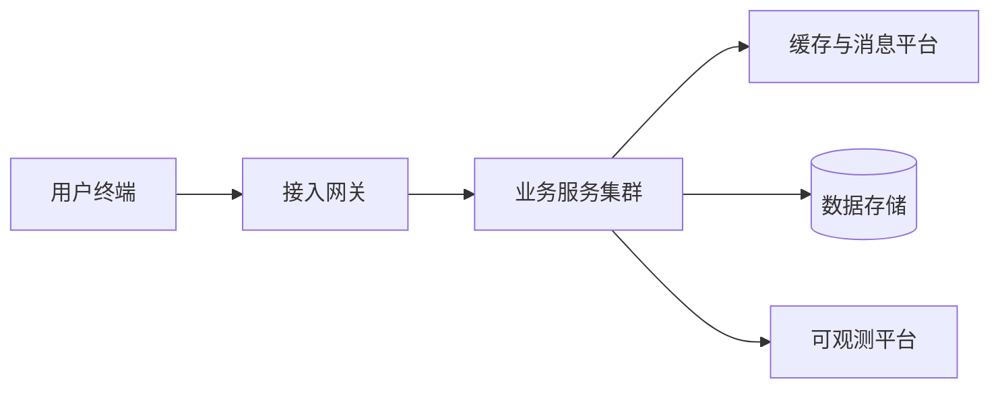

# 分布式高并发系统架构设计说明书

## 1. 建设背景

随着核心业务规模持续增长，现有系统需要在性能、可用性与交付效率方面完成系统化升级。

## 2. 建设目标

- 核心链路具备水平扩展能力。
- 关键服务满足高可用与故障隔离要求。
- 发布、监控、备份和回滚流程标准化。
- 设计、实施和验收材料完整可追溯。

## 3. 总体架构

## 4. 关键设计

### 4.1 高可用设计

服务采用多实例部署，结合健康检查、熔断、限流和降级策略控制故障影响范围。

### 4.2 数据一致性

核心交易采用明确的一致性边界，跨服务流程通过事件与补偿机制保证最终一致。

## 5. 部署与运维

| 项目 | 交付要求 | 验收方式 |
| --- | --- | --- |
| 部署 | 自动化、可回滚 | 部署演练 |
| 监控 | 指标、日志、链路完整 | 告警验证 |
| 备份 | 定期备份与恢复验证 | 恢复演练 |

## 6. 交付清单

1. 系统架构设计说明书。
2. 部署配置与环境清单。
3. 测试、验收与性能报告。
4. 运维手册和应急预案。