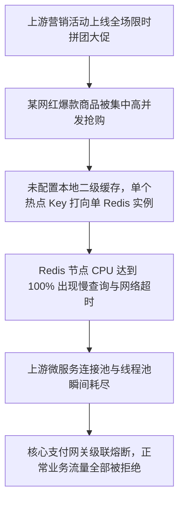

# 生产环境重大故障复盘与根因分析报告 (Postmortem)

## 一、事故核心概要与影响定级

### 1.1 事故基本事实

* **故障唯一标识**：`INC-20260918-001`
* **故障严重等级**：**P1 级故障（核心链路严重受损）**
* **受影响核心系统**：在线支付结算网关与订单核心微服务
* **事故发生时间**：2026 年 09 月 18 日 14:22:10 (UTC+8)
* **故障恢复时间**：2026 年 09 月 18 日 15:08:45 (UTC+8)
* **故障持续总时长 (MTTR)**：**46 分 35 秒**
* **事故总指挥 (Incident Commander)**：运维保障部总监
* **主笔调查人**：分布式架构师 / 核心交易组 Lead

### 1.2 故障关键度量指标

<!-- caption: 事故响应与恢复关键指标度量 (MTTR 拆解) -->
| 度量指标 | 耗时时长 | 目标 SLA 要求 | 达成状态 | 偏差分析 |
| :--- | :---: | :---: | :---: | :--- |
| **平均发现时间 (MTTD)** | **3 分 12 秒** | < 2 分钟 | ⚠️ 偏慢 | 核心接口告警阈值聚合窗口偏长 (180s) |
| **平均介入时间 (MTTA)** | **2 分 45 秒** | < 3 分钟 | ✅ 达标 | 值班 SRE 电话呼叫并在 3 分钟内拉起会议 |
| **故障定界时间 (MTTI)** | **18 分 20 秒** | < 10 分钟 | ❌ 未达标 | 依赖的第三方存管服务超时导致链路排查误导 |
| **平均缓解时间 (MTTR)** | **22 分 18 秒** | < 15 分钟 | ❌ 未达标 | 热点缓存雪崩后平滑预热耗时偏长 |

### 1.3 业务影响面评估

1. **交易订单影响**：事故期间总计产生异常中断交易请求 **24,180 笔**，支付成功率由平常的 99.98% 骤降至 **41.2%**。
2. **客诉情况**：在线客服入口短时排队堆积达 800+ 人，触发服务限流兜底。
3. **资金安全与资损评估**：经对账系统全量轧账核实，未发生重复扣款或单边账，最终直接经济资损为 **0 元**。

<!-- pagebreak -->

## 二、事故毫秒级完整时间线 (Timeline)

<!-- caption: 事故发生、定界、止血与恢复全过程时间线记录表 -->
| 时间戳 (UTC+8) | 事件节点 | 处理责任人 | 关键现象与动作描述 |
| :---: | :---: | :---: | :--- |
| **14:22:10** | 异常触发 | 系统自动 | 支付网关线程池打满，核心 Dubbo 接口调用平均 RT 从 18ms 激增至 3200ms |
| **14:25:22** | 监控告警 | Prometheus | 触发 `PaymentGatewayHighLatency` P1 告警，自动电话呼唤 SRE 一线值班 |
| **14:28:07** | 应急响应 | 值班 SRE | 值班 SRE 介入，确认非机房物理网络抖动，拉起紧急事故治理作战群 |
| **14:35:40** | 架构定界 | 交易架构师 | 发现 Redis Cluster 节点 `10.20.44.18` 内存突增至 100%，引发大量慢查询 |
| **14:41:15** | 止血决策 | 事故总指挥 | 决策执行：1. 网关切流至备用集群；2. 启动非核心风控异步化降级开关 |
| **14:49:30** | 关键操作 | 数据库 DBA | 隔离异常热点缓存 Key，临时调大连接池至 2,000，逐步放开流量切流比例 |
| **15:02:18** | 链路观察 | SRE 团队 | 核心支付成功率回升至 99.5%，RT 稳定回落至 25ms 以内，无新增堆积 |
| **15:08:45** | 事故闭环 | 事故总指挥 | 确认业务各核心链路完全恢复正常指标，正式宣布应急响应解除，转入复盘 |

<!-- pagebreak -->

## 三、故障根本原因深入分析 (5-Whys)

### 3.1 故障传播与级联雪崩因果链

### 3.2 5-Whys 根因递进挖掘

1. **Why 1**：为什么支付成功率骤降？
   * *回答*：因为支付核心微服务出现线程阻塞与超时，上游接口大面积超时抛出 504 Gateway Timeout。
2. **Why 2**：为什么微服务出现线程池耗尽？
   * *回答*：下游依赖的 Redis 缓存集群出现大量读超时，默认超时时间未设上限导致线程堆积。
3. **Why 3**：为什么 Redis 缓存会出现大量单点瓶颈？
   * *回答*：运营方临时上线的秒杀商品产生了高达 85,000 QPS 的单一 Key 请求，形成了单分片极度倾斜的热点 Key。
4. **Why 4**：为什么没有提前发现该热点 Key？
   * *回答*：业务线缺乏自动化热点 Key 探测与自动本地二级缓存（Caffeine）同步机制。
5. **Why 5（根因）**：为什么重大促销活动缺少架构保障？
   * *回答*：**技术变更流程与运营促销活动之间缺乏自动化报备与容量评估机制**，技术团队在未完成容量预估的前提下承载了超量突发流量。

---

## 四、纠正与预防措施清单 (CAPA Action Items)

<!-- caption: 事故后纠正与长期预防性改进措施追踪表 (CAPA) -->
| 措施 ID | 措施类型 | 具体行动内容 (Action Item) | 主责任人 | 计划完成时间 | 当前跟进状态 |
| :---: | :---: | :--- | :---: | :---: | :---: |
| **ACT-01** | **防御兜底** | 支付核心服务全量接入热点 Key 自动发现与 Caffeine 本地多级缓存机制 | 王工 (交易组) | 2026-09-22 | 🟡 联调测试中 |
| **ACT-02** | **参数整改** | 全面审计所有微服务 Redis/RPC 客户端超时时间，强制设置 300ms 熔断阈值 | 李工 (架构组) | 2026-09-24 | ⚪ 待开始 |
| **ACT-03** | **监控加固** | 将 P1 级告警采样聚合周期从 180s 缩短至 30s，接入钉钉/电话双通道高频通知 | 赵工 (运维部) | 2026-09-20 | 🟢 已上线验证 |
| **ACT-04** | **机制流程** | 建立“重大营销活动容量预审与限流演练流程”，未演练活动严禁直接全量切流 | 陈总 (技术总监) | 2026-09-26 | ⚪ 制度起草中 |
| **ACT-05** | **容灾演练** | 组织生产级单机房故障逃逸与突发大促全链路故障注入演练 (Chaos Testing) | 架构委员会 | 2026-09-30 | ⚪ 演练筹备中 |
