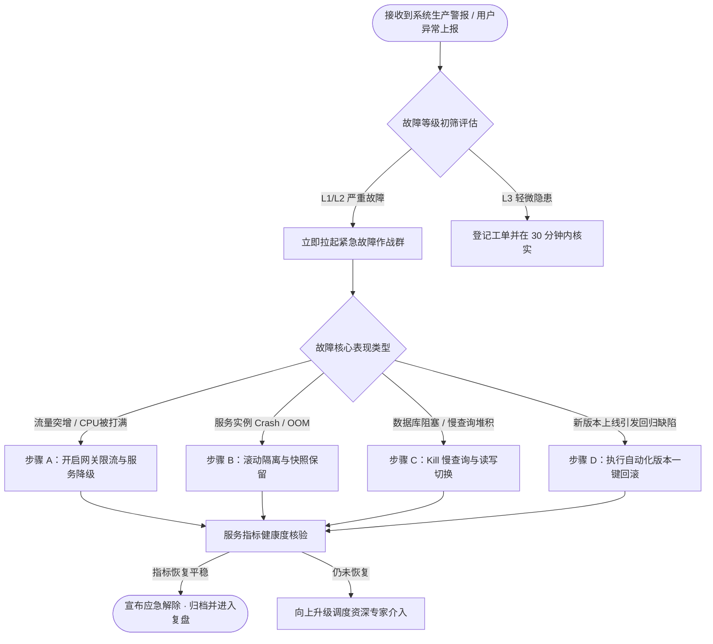

# 生产环境运维应急排障标准操作规程 (SOP)

## 一、规程概述与适用范围

### 1.1 目的与适用边界

本操作规程（Standard Operating Procedure）为企业生产环境 **核心分布式服务集群与基础设施** 在面临突发高负载、网络抖动、数据库死锁及服务瘫痪等异常时，提供标准化、可执行、受控的安全排障处置指南。

所有参与值班的一线 SRE、系统运维工程师、中间件及数据库管理员在处置突发事件时，**必须严格遵守本规程的指引执行**，避免非受控操作引发次生灾害。

> ⚠️ **操作底线原则**：
> 1. 先止血、后定位；
> 2. 任何生产写操作必须具备快速回滚方案（Rollback Plan）；
> 3. 任何非受控破坏性命令（如 `rm -rf`、`kill -9`、无条件 `DROP/DELETE`）严禁在生产终端直接执行。

---

## 二、应急响应等级与通报机制

<!-- caption: 生产故障应急分级与升级联动通报标准 -->
| 应急级别 | 故障判定标准 | 允许最大止血时间 | 响应责任人 | 通报范围与渠道 |
| :---: | :--- | :---: | :---: | :--- |
| **Level 1 (极度严重)** | 核心业务全面不可用，支付/登录大面积失败 | **< 10 分钟** | 技术副总裁、总架构师、SRE 主管 | 电话强通知、全员紧急广播群、CTO 直报 |
| **Level 2 (高度严重)** | 关键子模块受损，单机房不可用，部分用户受影响 | **< 20 分钟** | 业务线 Tech Lead、核心运维主管 | 内部值班飞书/钉钉紧急报警群、短信呼叫 |
| **Level 3 (一般异常)** | 局部功能轻微降级，有可替代备用链路 | **< 60 分钟** | 一线值班 SRE、轮值工程师 | 监控协同看板、标准工单系统 |

<!-- pagebreak -->

## 三、应急决策分流流向图



<!-- pagebreak -->

## 四、核心标准处置步骤与命令手册

### 4.1 场景 A：微服务突发流量打满与网关限流操作

#### 步骤 1：确认网关流量与 QPS 突增来源
在堡垒机执行以下监控命令，分析当前 Top 5 外部请求 IP 与热点 URI：

```bash
# 查询当前网关访问日志前 10 个高频请求 IP
tail -n 10000 /var/log/nginx/access.log | awk '{print $1}' | sort | uniq -c | sort -nr | head -n 10

# 检查当前网关活跃并发连接状态
netstat -nat | grep :443 | awk '{print $6}' | sort | uniq -c | sort -n
```

#### 步骤 2：下发 Sentinel / Nginx 限流热更配置
若确认存在恶意爬虫或异常单 IP 轰炸，通过动态控制台或热重载配置文件阻断：

```bash
# 执行 Nginx 白名单/黑名单规则测试与平滑重载
nginx -t && nginx -s reload
```

---

### 4.2 场景 B：Java 微服务 OOM 崩溃与线程堆栈快照导出

```bash
# 1. 查询当前 CPU / 内存占用最高的目标 Java 进程 PID
top -b -n 1 | grep java

# 2. 导出正在挂死进程的线程堆栈快照（保留现场分析依据）
jstack -l <PID> > /data/dumps/jstack_<PID>_$(date +%Y%m%d%H%M%S).dump

# 3. 触发生成堆内存快照（排查内存泄漏核心）
jmap -dump:live,format=b,file=/data/dumps/heap_<PID>.hprof <PID>
```

---

## 五、验证检查清单与服务恢复确认 (Checklist)

<!-- caption: 应急处置操作完成后验收核查清单 -->
| 检查序号 | 验收检查项 (Verification Item) | 验证方式与标准 | 确认责任人 | 确认时间 |
| :---: | :--- | :--- | :---: | :---: |
| **01** | 网关 5xx 错误率检查 | HTTP 5xx 错误率应稳定在 **< 0.05%** | 一线值班 SRE | 14:45 |
| **02** | 核心接口响应延迟 (P99) | 支付与交易接口 P99 延迟恢复至 **< 50ms** | 架构组专家 | 14:48 |
| **03** | 数据库连接池与活跃线程 | 数据库活跃连接数回落至容量阈值的 **30% 以下** | DBA 专员 | 14:50 |
| **04** | 核心业务链路真机冒烟验证 | 测试人员在生产环境真实完成一笔端到端下单履约闭环 | QA 负责人 | 14:52 |
| **05** | 临时限流与降级开关恢复预案 | 制定在未来 2 小时内平滑逐步解除临时降级的具体时间表 | 业务线主管 | 14:55 |
