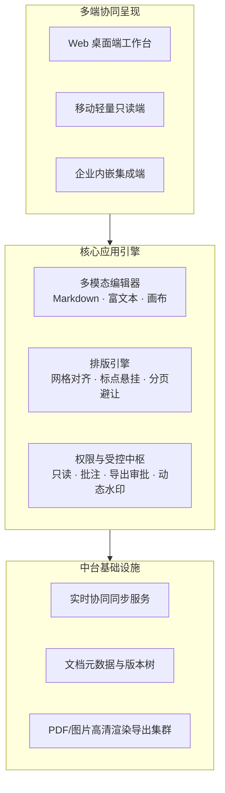
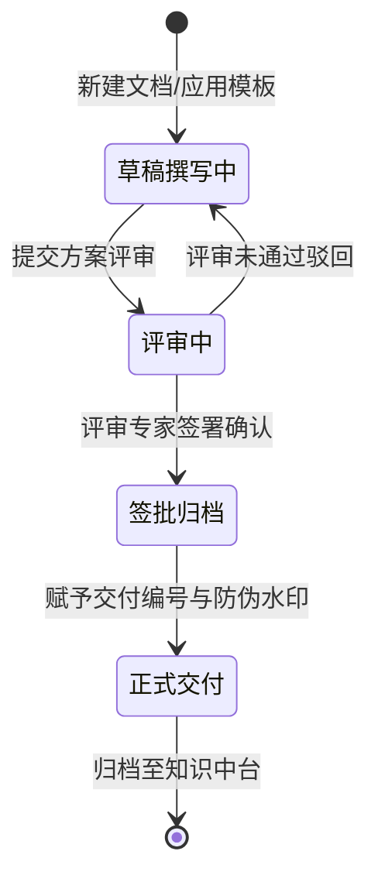

# 产品需求规格说明书 (PRD)

## 一、文档基本信息与版本修订历史

### 1.1 文档控制信息

* **产品名称**：企业级协同文档与知识中台 (Knowledge Hub)
* **版本编号**：v2.1.0-Release
* **产品负责人 (PM)**：高级产品经理
* **技术负责人 (Tech Lead)**：架构设计组总监
* **UI/UX 负责人**：体验设计团队 Lead
* **当前状态**：已评审通过 · 研发排期中

### 1.2 版本修订记录

<!-- caption: 产品需求版本演进与修订历史表 -->
| 版本号 | 修订日期 | 修订章节 | 修订内容简述 | 修订人 | 审核人 |
| :---: | :---: | :--- | :--- | :---: | :---: |
| **v1.0.0** | 2026-05-10 | 全文 | 初版 PRD 编写完成，定义基础在线文档编辑能力 | 李明 | 张华 |
| **v1.5.0** | 2026-07-15 | 第 4 章节 | 补充协同光标、冲突消解及离线草稿暂存能力 | 李明 | 王强 |
| **v2.0.0** | 2026-08-20 | 第 5、6 章节 | 新增知识库权限矩阵、水印防泄密与多端导出规范 | 陈洁 | 张华 |
| **v2.1.0** | 2026-09-18 | 第 6、7 章节 | 优化全屏打印分页预览交互，完善埋点监控方案 | 李明 | 赵磊 |

<!-- pagebreak -->

## 二、产品背景与业务目标

### 2.1 业务背景

随着公司跨部门协作团队规模扩张至 2,000+ 人，原有分散在各处的 Wiki、邮件附件及离线 Office 文件造成严重的知识孤岛、版本冲突与信息泄露风险。

为解决组织级文档“找不全、改不动、易泄露、难追溯”的痛点，需构建企业级统一协同文档中台，实现研发交付物、产品规范、运营手册的一站式闭环受控管理。

> 🎯 **产品愿景**：打造兼具纯粹沉浸书写体验、高规格排版美学与企业级合规受控的次世代协同文档基础设施。

### 2.2 核心业务目标 (OKR)

1. **工作效率提升**：协同文档平均共享与流转时间缩减 **75%**，方案评审协同效率提升 **40%**。
2. **交付物一致性**：企业对外技术交付文档统一采用标准化模板，格式合规率达到 **100%**。
3. **安全防泄密**：全量支持动态防伪水印、外发权限溯源，实现 0 起受控文档截屏泄密事故。

---

## 三、目标用户画像与核心场景

<!-- caption: 目标用户画像与诉求分析表 -->
| 用户角色 | 典型特征 | 核心痛点与需求 | 期望价值 |
| :--- | :--- | :--- | :--- |
| **技术架构师 / 研发** | 习惯 Markdown、重视架构图与代码块排版 | 传统办公软件排版复杂、代码高亮效果差、公式与流程图难维护 | 纯文本高效书写、Mermaid/LaTeX 一键渲染、代码高亮 |
| **产品经理 (PM)** | 频繁撰写 PRD、跟踪版本、跨团队宣讲 | 需求反复变更后缺乏变更追踪，多方评审意见零碎难以闭环 | 版本差异精准对比、受控签审交付、优雅导出一览 |
| **项目交付经理 (PMO)** | 面向客户输出正式交付物、验收报告 | 团队产出风格不一、缺乏标准封面、无法满足甲方严苛交付格式 | 规范化封面目录、自动双语页眉页脚、一键打印成册 |

<!-- pagebreak -->

## 四、功能架构与特性清单

### 4.1 整体功能架构

### 4.2 特性需求优先级矩阵

<!-- caption: PRD 特性清单与交付优先级评定表 -->
| 特性 ID | 模块名称 | 需求描述 | 优先级 | 依赖项 | 计划交付版本 |
| :---: | :--- | :--- | :---: | :---: | :---: |
| **FEAT-01** | 排版配置 | 支持一键切换企业红头、极简白皮书、科技规格等预设主题 | **P0** | 无 | v2.1.0 |
| **FEAT-02** | 水印受控 | 支持文字/点阵平铺防伪水印，允许自定义旋转角、透明度及页面覆盖范围 | **P0** | FEAT-01 | v2.1.0 |
| **FEAT-03** | 跨页智能避让 | 标题后至少连带两行正文，表格与流程图默认整块避让分页符 | **P0** | FEAT-01 | v2.1.0 |
| **FEAT-04** | 双语页眉页脚 | 奇偶页对称排布、页码总页数动态计算、封面自动隐藏 | **P1** | FEAT-01 | v2.1.0 |
| **FEAT-05** | 本地草稿恢复 | 浏览器意外关闭或网络中断后自动提示恢复未保存草稿 | **P1** | 无 | v2.1.0 |
| **FEAT-06** | 离线桌面客户端 | 基于系统原生 API 实现本地 Markdown 文件快速双击打开与直接保存 | **P2** | FEAT-01 | v2.2.0 |

<!-- pagebreak -->

## 五、核心业务流程与交互状态

### 5.1 文档全生命周期状态机

### 5.2 核心异常分支与交互原则

1. **网络连接断开时**：
   * 界面顶栏立即显示“⚠️ 离线模式：已自动保存至本地浏览器安全存储”，禁止阻断用户继续键入。
   * 重新联网后自动静默比对时间戳，无冲突时直接同步并提示“已同步至最新服务端版本”。
2. **导出大文件渲染超时**：
   * 若超长文档渲染超过 10 秒，弹出进度百分比提示，允许用户在后台异步下载。

---

## 六、数据埋点与指标监控需求

<!-- caption: 核心关键行为埋点指标规范表 -->
| 事件代码 (Event ID) | 事件中文名称 | 触发时机 | 上报核心参数 | 业务价值评估 |
| :--- | :--- | :--- | :--- | :--- |
| `doc_template_apply` | 模板应用 | 用户在欢迎中心点击并应用指定模板 | `template_id, category_id, theme_id` | 衡量各模板欢迎度与实用性 |
| `doc_theme_switch` | 主题切换 | 用户在样式面板切换文档排版主题 | `from_theme_id, to_theme_id` | 统计最受欢迎的企业配色方案 |
| `doc_export_pdf` | PDF 导出执行 | 用户点击触发打印或浏览器 PDF 保存 | `page_count, duration_ms, has_watermark` | 评估导出负载与核心导出链路成功率 |
| `doc_draft_restore` | 草稿恢复 | 用户点击“恢复草稿”按钮 | `document_id, draft_age_seconds` | 衡量异常退出后的数据挽回价值 |
