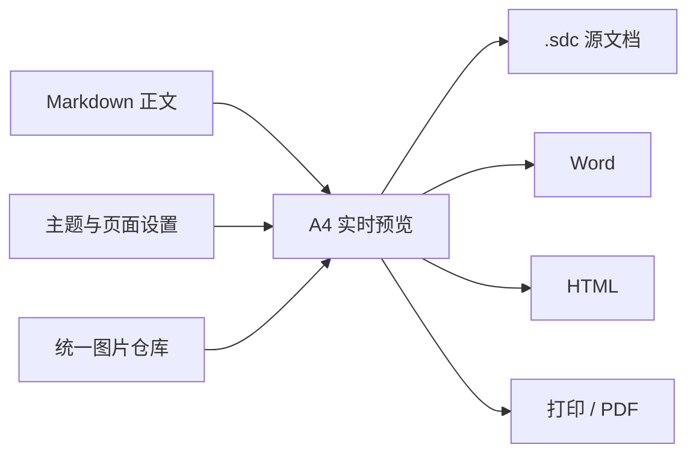

# SangDocCraft 使用范本

本文档用于演示本系统支持的主要 Markdown 排版能力。顶部「文件」菜单负责新建、打开、保存与模板中心，顶部「图片」按钮管理图片素材；右侧面板可配置封面、目录（标题表达形式、引导线与层级字体）、页眉页脚、字体、配色、Mermaid 图表、正文间距和分页规则；主题菜单用于切换预设主题与导入、导出自定义主题。

## 高效编辑与预览

编辑器支持选中一行或多行后按 `Tab` 增加缩进、按 `Shift+Tab` 减少缩进，也可以直接粘贴剪贴板图片，系统会将图片存入当前文档并插入内部引用。

编辑器工具栏右侧的齿轮按钮可调整编辑区字体、字号和行距，设置会被记住，也可以一键恢复默认。选中一段文本后，编辑器底部状态栏会显示选中字符数，悬停或聚焦该提示可查看更详细的统计信息；状态栏同时显示正在保存、有未保存修改或最近自动保存时间。

顶部视图按钮可在双栏预览、专注编辑和 A4 全屏之间切换，双栏模式下可按住中间分隔条拖动调整编辑区宽度。

### 定位与分页检查

双栏模式下双击 Markdown 内容，右侧 A4 预览会滚动到对应位置；双击预览正文也可以定位回编辑器。注意：开启滚动同步后双击定位会停用，需要定位时请先关闭滚动同步。

编辑器底部状态栏的「滚动同步」开关为双向同步：滚动预览会同步编辑器位置，滚动编辑器也会同步预览；关闭后可独立检查版式。

预览左上角的「文档大纲」按钮默认收起，展开后可快速跳转章节；底部分页栏可直达首页或尾页，也可以输入目标页码后回车跳转。若某页内容超过 A4 可用高度，预览会显示提醒并列出对应页码，交付前应检查标题、表格、图片和代码块是否需要手动分页。

### 封面与页眉页脚动态字段

右侧「样式」面板中，封面条目的值以及页眉页脚的左、中、右文字都可点击输入框内右侧的「＋」选择文档信息：`@title` 标题、`@subtitle` 副标题、`@author` 作者、`@department` 部门、`@organization` 组织、`@date` 日期、`@number` 编号和 `@version` 版本。页眉页脚还可选择 `@h1` 一级章节、`@h2` 二级章节；预览及 HTML / PDF 中，当前章节没有二级标题时 `@h2` 使用一级标题，封面没有正文章节，目录页使用目录标题。

每个输入框只能解析独占整个输入值的字段：`@title` 有效，`文档：@title` 会原样显示；选择变量会替换原值。A4 预览、HTML 与打印 PDF 按页面解析章节；Word 使用标题引用域，只有整篇文档都没有二级标题时 `@h2` 才回退到一级标题，章节交界处请核对导出效果。

### 文档水印

在右侧「样式」面板的「其他」页签中启用「文档水印」。水印可使用文本或文档内图片，选择页面居中显示单个大标，或按间距平铺；还可调整文字大小、颜色、透明度、旋转角度和图片宽度。默认不在封面显示，需要时可取消隐藏封面水印。

水印会显示在 A4 预览中，并保留在导出的 HTML 与通过打印生成的 PDF 中；当前导出 Word 时不包含水印。

## AI 辅助编辑与审查

顶部“AI 助手”可打开对话浮窗，编辑器工具栏也提供快速入口。首次使用时，在 AI 设置中维护多个服务端点、模型与推理强度，编写系统提示词和快捷提示词，并可测试当前模型连接。

AI 可以读取当前文档状态、章节大纲和指定正文，协助润色内容、调整封面与排版配置或执行批量 Markdown 编辑。涉及正文修改时，系统会先创建历史快照（未启用历史时会自动开启），再打开差异审查面板：可以逐项接受或拒绝变更，也可以全部处理或取消本次修改；工具调用失败或超时后可以重试。当前文档的 AI 对话会随 `.sdc` 文档保存和恢复。

## 文本与列表

正文支持 **粗体**、*斜体*、删除线、[普通链接](https://example.com) 和行内代码 `Ctrl+S`。

上标与下标使用 `<sup>` 与 `<sub>`，工具栏中也有对应按钮，导出 HTML 与 Word 时会保留上下标语义，例如水的分子式 H<sub>2</sub>O 和质能方程 E = mc<sup>2</sup>。

交付前建议完成以下检查：

- [ ] 核对封面信息与文档标题
- [ ] 检查目录、页眉、页脚和页码
- [ ] 收集正文、封面和页眉中的网络图片
- [ ] 下载或保存 .sdc 文档作为源文件
- [ ] 导出 Word、HTML 或 PDF 并检查最终效果

## 表格与题注

在表格上方添加 caption 注释可生成表格题注（注释与表格之间可以空行，暂不支持把注释放在表格下方）。题注位置、编号前缀（默认「表 」）和自动编号可在右侧「样式」面板中调整。

<!-- caption: 交付格式与适用场景 -->
| 格式 | 内容 | 适用场景 |
| :--- | :--- | :--- |
| .sdc | 正文、主题、图片、设置与历史 | 继续编辑与完整备份 |
| .docx | Word 文档，不保证完全保留排版 | 更换格式编辑 |
| .html | 自包含单文件网页 | 浏览与归档 |
| .pdf | 通过系统打印生成的 A4 文档 | 固定版式交付与打印 |

## 图片与内部资源

下面是一张带宽度限制的网络图片。打开顶部「图片」按钮并点击“收集文档网络图片”，系统会下载正文、封面和页眉中的网络图片，按内容去重，并将 URL 改写为 `@images/<id>`（普通超链接不会被改写）。

{w=520}

从编辑器工具栏插入内部图片时，可以留空尺寸，也可以生成以下形式：

`{w=640 h=360 align=right}`

宽高与对齐均可省略；`align` 支持 `left`、`center`、`right`，只控制图片位置，题注对齐仍由主题中的图片题注设置决定。

也可以在 A4 预览中点击正文图片，用右侧或底部手柄分别拖动宽度和高度；悬浮工具条可输入像素尺寸、切换左中右对齐。松手或确认后只修改当前图片的 Markdown 属性并重新分页。只指定宽度时保持原始比例，同时指定宽高时按设定尺寸拉伸，预览与打印保持一致。滚动预览或开合设置面板会取消选中。

仍被正文、封面或页眉引用的图片不能删除；删除不可撤销，且引用该图片的历史快照会同步失效。自定义主题使用的图片会保存到永久图片库，并使用 `@library/<id>` 引用。

单张图片可压缩为 WebP，并选择“生成副本”或“覆盖原图”：覆盖时图片 ID 不变，正文、封面和页眉中的引用无需修改即可生效。点击图片管理器中的「整体压缩」可以批量优化整个文档：调整 WebP 质量、按显示尺寸重采样（倍率可选 1x、1.5x、2x，不会放大原图）、移除未被引用的图片，完成后会给出压缩数量与节省体积统计。

<!-- pagebreak -->

# 图表、代码与分页

正文中的 `<!-- pagebreak -->` 会强制从新页开始，本节标题前就使用了一个。

Mermaid 图表使用标准围栏代码块，未写单图主题时沿用右侧「样式」面板中「Mermaid 图表配色」的设置（初始为 `neutral`）：



如需只调整一张图，可在围栏语言后追加属性。下面的图表使用面板中保存的 `custom` 配色，并指定宽度、高度及居中对齐；即使文档默认主题不是 `custom`，单图设置也会生效：

<!-- caption: 测试 Mermaid 题注 -->


`theme` 还可选 `neutral`、`default`、`dark`、`forest`、`base`；`w` 可写像素或百分比，`h` 可写像素或 `auto`，`align` 可选 `left`、`center`、`right`。显式高度会用于分页占位，设置过小可能裁切图表；Word 导出会按页面范围等比缩放图表。

A4 预览中点击图表，也可通过悬浮工具条调整单图主题、像素尺寸与对齐，或拖动右侧和底部手柄；确认后只更新当前围栏首行，不改图表源码。选择「文档默认」会移除单图主题属性。图内已有 `init` 主题指令时，不能在工具条中覆盖该主题。

Mermaid 图表支持图题注，方法是在围栏前添加 `<!-- caption: 题注文本 -->` 注释。

代码块会保留语言标识并按主题显示，下面是 `.sdc` 文档包中 `settings.json` 的片段：

```json
{
  "historyEnabled": true,
  "historyIdleMinutes": 10
}
```

## 数学公式

数学公式使用 LaTeX 语法，行内公式写在单个 `$` 之间，例如检索打分中的 $S_{dense}(q, d)$；独立公式块用独占一行的 `$$`，例如：

$$
S(q, d) = \alpha \cdot S_{dense}(q, d) + (1 - \alpha) \cdot S_{bm25}(q, d)
$$

也支持 `\(...\)`、`\[...\]` 与 `\begin{equation}...\end{equation}` 等写法。公式会被渲染为矢量图并参与分页测量：导出 HTML 与 PDF 时保持矢量清晰，导出 Word 时自动转换为图片。为避免误判，正文中的货币金额（如 `$5`）不会被识别为公式。

## 保存、草稿与文档历史

Web 端的自动保存与 `Ctrl+S` 只写入浏览器草稿，不会自动下载文件，需要迁移或备份时应从「导出」菜单明确下载 `.sdc`；Tauri 端首次 `Ctrl+S` 选择 `.sdc` 路径，之后手动保存与防抖自动保存都会写入该文件。应用启动时检测到未保存草稿会询问是否恢复。

在顶部「文件」菜单 →「历史快照与自动备份」中可为当前文档启用编辑历史，并设置无修改多少分钟后生成快照（1～120 分钟）。手动保存也会生成快照；相同内容不会重复记录，最多保留 50 条，图片二进制不会在历史中重复复制。

历史面板支持预览快照、复制其 Markdown、恢复内容、单独删除某条快照或清空全部历史；每条快照会记录生成时的文档版本号，便于与正式交付版本对照。

## 打印与导出

在顶部「导出」菜单 →「打印 / 导出 PDF」中，系统会生成隔离的 A4 页面并内联图片与图表。点击“打印 / 另存为 PDF”，在系统打印面板中选择“另存为 PDF”、边距设为“无”并启用“背景图形”，即可输出固定版式文件；也可以从同一窗口下载自包含 HTML。

同一菜单中还可直接导出 Word、单文件 HTML 与完整 `.sdc` 文档包，正式交付前建议先完成上文的检查清单。
