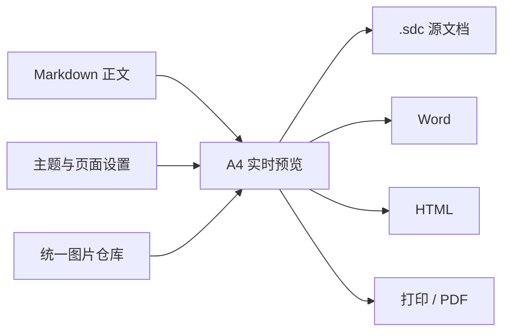

# SangDocCraft 使用范本

本文档用于演示本系统支持的主要 Markdown 排版能力。可在右侧设置封面、目录、页眉页脚、字体、配色和分页规则。

## 高效编辑与预览

编辑器支持选中一行或多行后按 `Tab` 增加缩进、按 `Shift+Tab` 减少缩进，也可以直接粘贴剪贴板图片，系统会将图片存入当前文档并插入内部引用。

编辑器工具栏右侧的齿轮按钮可调整编辑区字体、字号和行距，设置会被记住，也可以一键恢复默认。

选中一段文本后，编辑器底部状态栏会显示选中字符数；将鼠标悬停在该提示上，可以查看更详细的统计信息。

在双栏模式下双击 Markdown 内容，右侧 A4 预览会滚动到对应位置。预览左上角的文档大纲可快速跳转章节，页码导航可用于翻页或输入目标页码。编辑器底部会显示正在保存、有未保存修改或最近自动保存时间。

## AI 辅助编辑与审查

顶部“AI 助手”可打开对话浮窗，编辑器工具栏也提供快速入口。首次使用时，在 AI 设置中配置服务端点、模型、系统提示词和快捷提示词，并可测试当前模型连接。

AI 可以读取当前文档状态、章节大纲和指定正文，协助润色内容、调整排版配置或执行批量 Markdown 编辑。涉及正文修改时，系统会先创建历史快照，再打开差异审查面板：可以逐项接受或拒绝变更，也可以全部处理或取消本次修改。当前文档的 AI 对话会随 `.sdc` 文档保存和恢复。

## 预览定位与分页检查

双栏模式下双击预览正文可以定位回编辑器，双击编辑器内容可以定位到对应预览位置。开启预览工具栏的滚动同步后，滚动预览会同步编辑器位置；关闭后可独立检查版式。

页码导航支持直接输入目标页码。若某页内容超过 A4 可用高度，预览会显示提醒并列出对应页码，交付前应检查标题、表格、图片和代码块是否需要手动分页。

## 文本与列表

正文支持 **粗体**、*斜体*、删除线、[普通链接](https://example.com) 和行内代码 `Ctrl+S`。

> Web 端的自动保存与 Ctrl+S 只写入浏览器草稿；Tauri 端会保存到当前 .sdc 文件。

交付前建议完成以下检查：

- [ ] 核对封面信息与文档标题
- [ ] 检查目录、页眉、页脚和页码
- [ ] 收集正文、封面和页眉中的网络图片
- [ ] 下载或保存 .sdc 文档作为源文件
- [ ] 导出 Word、HTML 或 PDF 并检查最终效果

## 表格与题注

在表格前添加 caption 注释可生成表格题注。

<!-- caption: 交付格式与适用场景 -->
| 格式 | 内容 | 适用场景 |
| :--- | :--- | :--- |
| .sdc | 正文、主题、图片、设置与历史 | 继续编辑与完整备份 |
| .docx | A4 排版后的 Word 文档 | 正式交付与修订 |
| .html | 自包含单文件网页 | 浏览与归档 |
| .pdf | 通过系统打印生成的 A4 文档 | 固定版式交付与打印 |

## 图片与内部资源

下面是一张带宽度限制的网络图片。打开顶部“图片”管理器并点击“收集文档网络图片”，系统会下载图片、按内容去重，并将 URL 改写为 `@images/<id>`。

{w=520}

从编辑器工具栏插入内部图片时，可以留空尺寸，也可以生成以下形式：

`{w=640 h=360}`

仍被正文、封面或页眉引用的图片不能删除。自定义主题使用的图片会保存到永久图片库，并使用 `@library/<id>` 引用。

<!-- pagebreak -->

# 图表、代码与分页

上方的 `<!-- pagebreak -->` 会强制从新页开始。Mermaid 图表使用标准围栏代码块：



代码块会保留语言标识并按主题显示：

```json
{
  "format": "SangDocCraft",
  "formatVersion": 1,
  "historyEnabled": true
}
```

## 数学公式

数学公式使用 LaTeX 语法，行内公式写在单个 `$` 之间，例如检索打分中的 $S_{dense}(q, d)$；独立公式块用独占一行的 `$$`，例如：

$$
S(q, d) = \alpha \cdot S_{dense}(q, d) + (1 - \alpha) \cdot S_{bm25}(q, d)
$$

也支持 `\(...\)`、`\[...\]` 与 `\begin{equation}...\end{equation}` 等写法。公式会被渲染为矢量图并参与分页测量：导出 HTML 与 PDF 时保持矢量清晰，导出 Word 时自动转换为图片。为避免误判，正文中的货币金额（如 `$5`）不会被识别为公式。

## 文档历史

在顶部历史按钮中可为当前文档启用编辑历史，并设置无修改多少分钟后生成快照。手动保存也会生成快照；相同内容不会重复记录，图片二进制不会在历史中重复复制。

## 打印与导出 PDF

打开顶部“打印 / 导出 PDF”，系统会生成隔离的 A4 页面并内联图片与图表。点击“打印 / 另存为 PDF”，在系统打印面板中选择“另存为 PDF”、边距设为“无”并启用“背景图形”，即可输出固定版式文件；也可以从同一窗口下载自包含 HTML。
