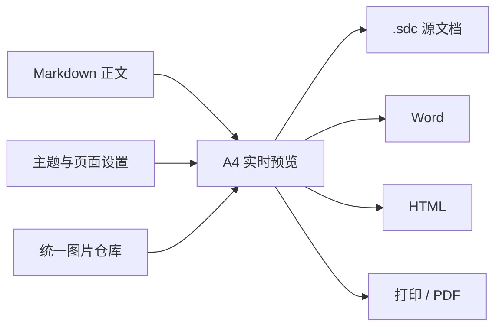

# 概述

本文档用于演示本系统支持的主要 Markdown 排版能力。顶部「文件」菜单负责新建、打开、保存与模板中心，顶部「图片」按钮管理图片素材；右侧面板可配置封面、目录（标题表达形式、引导线与层级字体）、页眉页脚、字体、配色、Mermaid 图表、正文间距和分页规则；主题菜单用于切换预设主题与导入、导出自定义主题。

本文档面向使用 SangDocCraft 撰写 A4 交付文档的撰写人、审校人与归档人。既可将其作为排版能力的完整范本，逐节对照学习；也可直接作为项目交付文档的起始模板，替换封面信息与正文内容后，复用既有的页眉页脚、目录、题注与水印配置。

文中语法与配置以 v6.0.0 为准，所有示例均可直接在正文中修改并实时预览。下表给出各章要点，便于按需跳转。

<!-- caption: 章节内容与阅读导航 -->
| 章节 | 主要内容 | 建议读者 |
| :--- | :--- | :--- |
| 文档信息与修订记录 | 文档编号、版本状态与变更过程 | 全部读者 |
| 概述 | 系统定位、读者对象与章节导航 | 首次接触本系统的读者 |
| 高效编辑与预览 | 编辑操作、预览定位、动态字段、水印与 AI 辅助 | 日常撰写人员 |
| 排版语法与内容元素 | 文本、表格、图片、图表、信息图、公式与自定义 HTML 的完整语法 | 需要精细排版的作者 |
| 保存与打印 | 草稿机制、历史快照、打印与多格式导出 | 交付与归档人员 |
| 常见问题 | 高频问题的现象与处理办法 | 全部读者 |
| 其他相关 | SKILL 命令行工具与安装方式 | 自动化集成人员 |
| 附录：排版语法速查 | 交付文档特殊语法一览 | 全部读者 |

# 高效编辑与预览

编辑器支持选中一行或多行后按 `Tab` 增加缩进、按 `Shift+Tab` 减少缩进，也可以直接粘贴剪贴板图片，系统会将图片存入当前文档并插入内部引用。

编辑器工具栏右侧的齿轮按钮可调整编辑区字体、字号和行距，设置会被记住，也可以一键恢复默认。选中一段文本后，编辑器底部状态栏会显示选中字符数，悬停或聚焦该提示可查看更详细的统计信息；状态栏同时显示正在保存、有未保存修改或最近自动保存时间。

顶部视图按钮可在双栏预览、专注编辑和 A4 全屏之间切换，双栏模式下可按住中间分隔条拖动调整编辑区宽度。

## 定位与分页检查

双栏模式下双击 Markdown 内容，右侧 A4 预览会滚动到对应位置；双击预览正文也可以定位回编辑器。注意：开启滚动同步后双击定位会停用，需要定位时请先关闭滚动同步。

编辑器底部状态栏的「滚动同步」开关为双向同步：滚动预览会同步编辑器位置，滚动编辑器也会同步预览；关闭后可独立检查版式。

预览左上角的「文档大纲」按钮默认收起，展开后可快速跳转章节；底部分页栏可直达首页或尾页，也可以输入目标页码后回车跳转。若某页内容超过 A4 可用高度，预览会显示提醒并列出对应页码，交付前应检查标题、表格、图片和代码块是否需要手动分页。

## 封面与页眉页脚动态字段

右侧「样式」面板中，封面条目的值以及页眉页脚的左、中、右文字都可点击输入框内右侧的「＋」选择文档信息：`@title` 标题、`@subtitle` 副标题、`@author` 作者、`@department` 部门、`@organization` 组织、`@date` 日期、`@number` 编号和 `@version` 版本。页眉页脚还可选择 `@h1` 一级章节、`@h2` 二级章节；预览及 HTML / PDF 中，当前章节没有二级标题时 `@h2` 使用一级标题，封面、目录页等无对应章节的页面则回退为文档标题与目录标题。

每个输入框只能解析独占整个输入值的字段：`@title` 有效，`文档：@title` 会原样显示；选择变量会替换原值。A4 预览、HTML 与打印 PDF 按页面解析章节；Word 使用标题引用域，只有整篇文档都没有二级标题时 `@h2` 才回退到一级标题，章节交界处请核对导出效果。

## 文档水印

在右侧「样式」面板的「其他」页签中启用「文档水印」。水印可使用文本或文档内图片，选择页面居中显示单个大标，或按间距平铺；还可调整文字大小、颜色、透明度、旋转角度和图片宽度。默认不在封面显示，需要时可取消隐藏封面水印。

水印会显示在 A4 预览中，并保留在导出的 HTML 与打印生成的 PDF 中；导出 Word 时暂不包含水印。

## AI 辅助编辑与审查

顶部「AI 助手」可打开对话浮窗，编辑器工具栏也提供快速入口。首次使用时，在 AI 设置中维护多个服务端点、模型与推理强度，编写系统提示词和快捷提示词，并可测试当前模型连接。

AI 可以读取当前文档状态、章节大纲和指定正文，协助润色内容、调整封面与排版配置或执行批量 Markdown 编辑。涉及正文修改时，系统会先创建历史快照（未启用历史时会自动开启），再打开差异审查面板：可以逐项接受或拒绝变更，也可以全部处理或取消本次修改；工具调用失败或超时后可以重试。当前文档的 AI 对话会随 `.sdc` 文档保存和恢复。

# 排版语法与内容元素

## 文本与列表

正文支持 **粗体**、*斜体*、~~删除线~~、[普通链接](https://example.com) 和行内代码 `Ctrl+S`。

上标与下标使用 `<sup>` 与 `<sub>`，工具栏中也有对应按钮，导出 HTML 与 Word 时会保留上下标语义，例如水的分子式 H<sub>2</sub>O 和质能方程 E = mc<sup>2</sup>。

交付前建议完成以下检查：

- [ ] 核对封面信息与文档标题
- [ ] 检查目录、页眉、页脚和页码
- [ ] 收集正文、封面和页眉中的网络图片
- [ ] 下载或保存 .sdc 文档作为源文件
- [ ] 导出 Word、HTML 或 PDF 并检查最终效果

## 表格与题注

在表格上方添加 caption 注释可生成表格题注（注释与表格之间可以空行，暂不支持把注释放在表格下方）。题注位置、编号前缀（默认「表 」）和自动编号可在右侧「样式」面板中调整。

<!-- caption: 交付格式与适用场景 -->
| 格式 | 内容 | 适用场景 |
| :--- | :--- | :--- |
| .sdc | 正文、主题、图片、设置与历史 | 继续编辑与完整备份 |
| .docx | Word 文档，不保证完全保留排版 | 更换格式编辑 |
| .html | 自包含单文件网页 | 浏览与归档 |
| .pdf | 打印 / 导出 PDF 生成的 A4 文档 | 固定版式交付与打印 |

## 图片与内部资源

下面是一张带宽度限制的网络图片。打开顶部「图片」按钮并点击「收集文档网络图片」，系统会下载正文、封面和页眉中的网络图片，按内容去重，并将 URL 改写为 `@images/<id>`（普通超链接不会被改写）。

{w=520}

从编辑器工具栏插入内部图片时，可以留空尺寸，也可以生成以下形式：

`{w=640 h=360 align=right}`

宽高与对齐均可省略；`align` 支持 `left`、`center`、`right`，只控制图片位置，题注对齐仍由主题中的图片题注设置决定。

也可以在 A4 预览中点击正文图片，用右侧或底部手柄分别拖动宽度和高度；悬浮工具条可输入像素尺寸、切换左中右对齐。松手或确认后只修改当前图片的 Markdown 属性并重新分页。只指定宽度时保持原始比例，同时指定宽高时按设定尺寸拉伸，预览与打印保持一致。滚动预览或开合设置面板会取消选中。

仍被正文、封面或页眉引用的图片不能删除；删除不可撤销，且引用该图片的历史快照会同步失效。自定义主题使用的图片会保存到永久图片库，并使用 `@library/<id>` 引用。

单张图片可压缩为 WebP，并选择「生成副本」或「覆盖原图」：覆盖时图片 ID 不变，正文、封面和页眉中的引用无需修改即可生效。点击图片管理器中的「整体压缩」可以批量优化整个文档：调整 WebP 质量、按显示尺寸重采样（倍率可选 1x、1.5x、2x，不会放大原图）、移除未被引用的图片，完成后会给出压缩数量与节省体积统计。

<!-- pagebreak -->

## 图表、代码与分页

### 分页与代码

正文中的 `<!-- pagebreak -->` 会强制从新页开始，本章二级标题前就使用了一个。

代码块会保留语言标识并按主题显示，下面是 `.sdc` 文档包中 `settings.json` 的片段：

```json
{
  "historyEnabled": true,
  "historyIdleMinutes": 10
}
```

### Mermaid 图表

Mermaid 图表使用标准围栏代码块，未写单图主题时沿用右侧「样式」面板中「Mermaid 图表配色」的设置（初始为 `neutral`）：

<!-- caption: 文档编写、预览与多格式导出的整体流程 -->

```mermaid {h=290 align=center}
flowchart LR
    Markdown[Markdown 正文] --> Preview[A4 实时预览]
    Theme[主题与页面设置] --> Preview
    Images[统一图片仓库] --> Preview
    Preview --> SDC[.sdc 源文档]
    Preview --> DOCX[Word]
    Preview --> HTML[HTML]
    Preview --> PDF[打印 / PDF]
```

如需只调整一张图，可在围栏语言后追加属性。下面的图表使用面板中保存的 `custom` 配色，并指定宽度、高度及居中对齐；即使文档默认主题不是 `custom`，单图设置也会生效：

<!-- caption: 单图主题、尺寸与对齐的独立覆盖 -->

```mermaid {theme=custom w=80% h=114 align=center}
flowchart LR
  Global[文档默认主题] --> Override[单图属性覆盖]
  Override --> Export[A4 预览与导出]
```

`theme` 还可选 `neutral`、`default`、`dark`、`forest`、`base`；`w` 可写像素或百分比，`h` 可写像素或 `auto`，`align` 可选 `left`、`center`、`right`。显式高度会用于分页占位，设置过小可能裁切图表；导出 Word 时会按页面范围等比缩放图表。图表题注可在围栏前添加 `<!-- caption: 题注文本 -->` 注释生成。

A4 预览中点击图表，也可通过悬浮工具条调整单图主题、像素尺寸与对齐，或拖动右侧和底部手柄；确认后只更新当前围栏首行，不改图表源码。选择「文档默认」会移除单图主题属性。图内已有 `init` 主题指令时，不能在工具条中覆盖该主题。

### AntV Infographic

信息图通过视觉语言压缩文字信息，让读者用最短时间抓住重点。以下是一个示例：

<!-- caption: 客户增长引擎信息图 -->
```infographic {w=680 h=330 align=center}
infographic list-row-horizontal-icon-arrow
data
  title 客户增长引擎
  desc 多渠道触达与复购提升
  items
    - label 线索获取
      value 18.6
      desc 渠道投放与内容获客
      icon rocket-launch
    - label 转化提效
      value 12.4
      desc 线索评分与自动跟进
      icon progress-check
    - label 复购提升
      value 9.8
      desc 会员体系与权益运营
      icon account-sync
    - label 口碑传播
      value 6.2
      desc 社群激励与推荐裂变
      icon account-group
```

> 更多用法，参见：[AntV Infographic Gallery](https://infographic.antv.vision/gallery)。

## 数学公式

数学公式使用 LaTeX 语法，行内公式写在单个 `$` 之间，例如检索打分中的 $S_{dense}(q, d)$；独立公式块用独占一行的 `$$`，例如：

$$
S(q, d) = \alpha \cdot S_{dense}(q, d) + (1 - \alpha) \cdot S_{bm25}(q, d)
$$

也支持 `\(...\)`、`\[...\]` 与 `\begin{equation}...\end{equation}` 等写法。公式会被渲染为矢量图并参与分页测量：导出 HTML 与 PDF 时保持矢量清晰，导出 Word 时自动转换为图片。为避免误判，正文中的货币金额（如 `$5`）不会被识别为公式。

## 高级自定义

当常规 Markdown 元素不足以表达版式需求（例如关键指标卡、方案对比矩阵、业务流程图链或签字栏）时，可使用自定义 HTML 区块获得更灵活的排版控制。区块以 section 元素声明 `data-sdc-html` 属性，内部可直接书写 HTML，并可内联 style 定义专属样式：

```html
<section data-sdc-html>
<style>
.sdc-card { border-left: 3px solid var(--accent-color); padding: 8px 12px; }
</style>
<div class="sdc-card">自定义内容</div>
</section>
```

为保持与文档主题一致，建议在自定义样式中统一引用主题色彩变量，这样切换主题或调整配色时无需改写 HTML：

<!-- caption: 自定义 HTML 可引用的主题色彩变量 -->
| 变量 | 典型用途 |
| :--- | :--- |
| `--primary-color` | 主色调，用于标题与强调文字 |
| `--accent-color` | 强调色，用于装饰线、图标与关键数值 |
| `--text-color` | 正文文字颜色 |
| `--text-secondary` | 辅助文字，如说明与副标题 |
| `--text-muted` | 弱化文字，如注脚与标签 |
| `--border-color` | 主边框颜色 |
| `--border-light` | 浅边框与分隔线颜色 |
| `--img-border-color` | 图片边框颜色 |

下面是一个直接引用上述变量实现的指标卡示例，配色会随文档主题同步变化：

<section data-sdc-html>
<style>
.sdc-demo{display:flex;gap:10px;margin:6px 0}
.sdc-demo-cell{flex:1;padding:10px 12px;text-align:center;border:1px solid var(--border-color);border-top:3px solid var(--accent-color);border-radius:6px}
.sdc-demo-cell b{display:block;font-size:20px;line-height:1.3;color:var(--primary-color)}
.sdc-demo-cell span{font-size:12px;color:var(--text-secondary)}
</style>
<div class="sdc-demo">
<div class="sdc-demo-cell"><b>10</b><span>内置 HTML 模板</span></div>
<div class="sdc-demo-cell"><b>8</b><span>主题色彩变量</span></div>
<div class="sdc-demo-cell"><b>4</b><span>导出文件格式</span></div>
</div>
<br>
</section>

除自行编写外，也可直接取用模板库中的现成组件，下表为内置模板及其适用场景：

<!-- caption: 内置 HTML 模板与适用场景 -->
| 模板名称 | 适用场景 |
| :--- | :--- |
| 基本信息卡 | 关键字段的网格化展示 |
| 项目团队架构 | 成员分工与联络方式 |
| 任务表格组件 | 任务进度与状态跟踪 |
| 关键指标 | 核心数据统计展示 |
| 实施里程碑 | 阶段目标与交付时间线 |
| 交付验收清单表格 | 交付成果验收标准与结论 |
| 业务实施流程 | 分步流程与核心行动 |
| 重点与风险提示 | 重要说明与合规风险备忘 |
| 方案对比矩阵 | 多方案优劣势分析与选型建议 |
| 签字确认 | 交付文档签字与日期栏 |

内置模板为只读，可直接引用并调整其中的文字内容；自定义模板支持新增与编辑，编辑时只需提交需要变更的字段，其 CSS 可继续引用上述色彩变量以跟随文档主题。

使用时需注意两点：自定义区块与正文一同参与 A4 分页测量，内容过高时应拆分或精简；导出 HTML 与打印 PDF 会完整保留内联样式，导出 Word 时复杂布局（如弹性布局、绝对定位）可能被简化，正式交付前请核对导出效果。

# 保存与打印

## 保存、草稿与文档历史

Web 端的自动保存与 `Ctrl+S` 只写入浏览器草稿，不会自动下载文件，需要迁移或备份时应从「导出」菜单明确下载 `.sdc`；Tauri 端首次 `Ctrl+S` 选择 `.sdc` 路径，之后手动保存与防抖自动保存都会写入该文件。应用启动时检测到未保存草稿会询问是否恢复。

在顶部「文件」菜单 →「历史快照与自动备份」中可为当前文档启用编辑历史，并设置无修改多少分钟后生成快照（1～120 分钟）。手动保存也会生成快照；相同内容不会重复记录，最多保留 50 条，图片二进制不会在历史中重复复制。

历史面板支持预览快照、复制其 Markdown、恢复内容、单独删除某条快照或清空全部历史；每条快照会记录生成时的文档版本号，便于与正式交付版本对照。

## 打印与导出

在顶部「导出」菜单 →「打印 / 导出 PDF」中，系统会生成隔离的 A4 页面并内联图片与图表。点击「打印 / 另存为 PDF」，在系统打印面板中选择「另存为 PDF」、边距设为「无」并启用「背景图形」，即可输出固定版式文件；也可以从同一窗口下载自包含 HTML。

同一菜单中还可直接导出 Word、单文件 HTML 与完整 `.sdc` 文档包，正式交付前建议先完成上文的检查清单。

# 常见问题

本章汇总使用过程中的高频问题，按场景归类；若按下列办法处理后仍未解决，可在 AI 助手中描述现象并请求协助定位。

## 编辑与预览

**双击 Markdown 正文或预览没有跳到对应位置？**

开启「滚动同步」后双击定位会停用，请先关闭编辑器底部状态栏中的滚动同步开关。

**编辑区的字号、行距如何恢复默认？**

点击编辑器工具栏右侧的齿轮按钮，在编辑区设置中一键恢复默认。

## 图片与图表

**网络图片在交付前需要处理吗？**

建议处理。网络图片依赖外部链接，点击「图片」→「收集文档网络图片」可将其下载到当前文档并改写为 `@images/<id>` 内部引用，避免交付后图片失效。

**图表内容被裁切怎么办？**

围栏中显式填写的 `h` 会参与分页占位，高度过小会裁切图表；请调大 `h`，或改为 `h=auto` 由内容自适应。

**信息图与 Mermaid 图可以单独换主题吗？**

Mermaid 可在围栏属性中用 `theme` 覆盖文档默认主题（可选 `neutral`、`default`、`dark`、`forest`、`base`、`custom`）；信息图使用自身配色方案，通过 `w`、`h`、`align` 控制尺寸与位置。

## 保存与导出

**`Ctrl+S` 保存的文件在哪里？**

Web 端的自动保存与 `Ctrl+S` 只写入浏览器草稿，需要迁移或备份时应从「导出」菜单明确下载 `.sdc` 文件。

**导出 Word 需要注意什么？**

Word 不保证完全保留排版，且暂不包含水印；公式会栅格化为图片、图表按页面范围等比缩放，交付前请逐页核对。

**打印 PDF 如何保证版式固定？**

在系统打印面板中选择「另存为 PDF」，边距设为「无」并启用「背景图形」，再执行打印。

**历史快照最多保留多少条？**

最多保留 50 条；相同内容不会重复记录，图片二进制不会在历史中重复复制。

# 其他相关

## 使用 SKILL

SangDocCraft 提供了 SKILL 工具（CLI）用于将文件夹、Markdown 或现有 `.sdc` 导出为 HTML，或将文件夹或 Markdown 打包成 `.sdc`。

要求 Node.js 20+。HTML 导出需要本机 Chrome 或 Edge（或设置 `SDC_CHROME_PATH`）；生成 `.sdc` 不需要浏览器。

如果需要安装 SKILL，复制下面的 prompt 发送给你的 AI：

```text
下载这个SKILL压缩包并安装 https://api.skillhub.cn/api/v1/download?slug=%40indiv-sang%2Fsdc-authoring 
```

也可以通过 `skillhub` 来安装：

```text
请根据 https://skillhub.cn/install/skillhub.md，安装 @indiv-sang/sdc-authoring。
```

## 打赏

如果你觉得 SangDocCraft 对你有帮助，可以通过扫描以下二维码进行打赏：

{h=311}

# 附录：排版语法速查

下表汇总交付文档中常用的特殊语法，便于撰写与审校时快速查阅。

<!-- caption: 交付文档特殊语法速查 -->
| 功能 | 语法 | 说明 |
| :--- | :--- | :--- |
| 强制分页 | `<!-- pagebreak -->` | 独占一行，其后内容从新的 A4 页面开始排版 |
| 表格题注 | `<!-- caption: 题注文本 -->` | 置于表格上一行（可空一行），默认自动编号为「表 n」 |
| 图片与图表题注 | `<!-- caption: 题注文本 -->` | 置于图片或围栏代码块上一行，默认自动编号为「图 n」 |
| 图片尺寸 | `{w=640 h=360}` | 只写 `w` 时保持原始比例，同时指定宽高时按设定尺寸拉伸 |
| 图片对齐 | `{align=right}` | 取值为 `left`、`center`、`right`，仅控制图片位置，题注对齐仍由主题设置决定 |
| 文档内图片 | `@images/<id>` | 当前文档的图片引用 |
| 永久库图片 | `@library/<id>` | 自定义主题等复用素材的引用 |
| Mermaid 图表 | 在 mermaid 围栏语言后追加 `{theme=dark w=80% h=320 align=center}` | `theme` 可覆盖文档默认主题，`w` 支持像素或百分比，`h` 支持像素或 `auto` |
| 信息图 | 在 infographic 围栏语言后追加 `{w=680 h=330 align=center}` | 使用 AntV Infographic DSL，支持列表、对比、层级、关系等结构 |
| 自定义 HTML | 在 section 元素上声明 `data-sdc-html` | 可内联 HTML 与 CSS，也可引用 `--primary-color` 等主题色彩变量；模板库另提供 10 类内置组件 |
| 行内公式 | 用一对美元符号包裹公式，如 `E = mc^2` | LaTeX 语法，随正文排版 |
| 块级公式 | 双美元符号独占两行，中间书写公式内容 | 参与分页测量，导出 Word 时栅格化为图片 |
| 上标与下标 | `<sup>`、`<sub>` 包裹文字 | 导出 HTML 与 Word 时保留上下标语义 |
| 任务清单 | `- [ ] 待核对项` | 渲染为可勾选样式，适合交付前检查清单 |

> 表中示例均为最小可用写法，更多参数组合可参考正文对应章节。